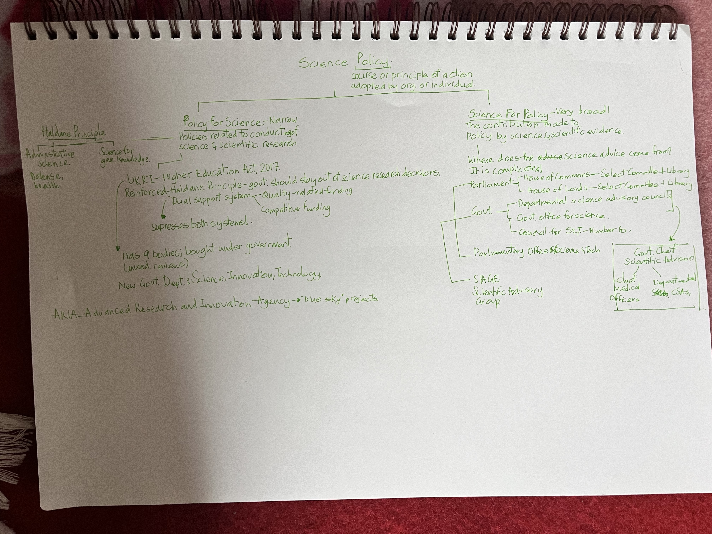

One of the reasons I why I chose Science Policy as one of my optional module is because I know so little about policy space. Of course, courses like The Welfare State, Foreign Policy, etc. at the Young India Fellowship has given me some vocabulary, but policy is just so complex given that it is intricately tied with governance and politics. To that point, the first objective of the course is to have "an appreciation of the complexity of the relationship between science, policy and politics" by the end. My lecturer, Vicki, is amazing. She has spent significant time in the UK science policy ecosystem and understands how it functions.

The below is a summary; it doesn't capture all of the complexities, but is a starting point. There are two ways in which science and policy are related: policy for science and science for policy. Whilst the former is more about funding and infrastructure for science, and the role of government, the latter is more diffused and broad. Another layer is the structure of UK government itself with Parliament having two houses, government having multiple departments.

_My rudimentary summary_

However, what excited me the most is this semi-independent body called POST: Parliamentary Office of Science and Technology. POST has policy experts who do horizon scanning, write (mostly) impartial policy reports called POSTnote for politicians to use as a reference. I read the one on drugs and therapy for Sickle Cell Anemia and beta thalassemia. Having worked very briefly on Rare Genetic Diseases, I was impressed by how thorough the document was in outlining in evidence, therapy options and challenges.

In the second half of the class, we whizzed through three policy frameworks: multiple streams approach, punctuated equilibrium, and advocacy coalition framework. Unlike linear or circular model of policy development, all of these attempt to capture a general method and messiness by which policies get drafted and implemented. I will add the summary of these frameworks soon.

Another realisation I had was that I should start thinking about the assignment from the get-go. I have reached out to few experts, but maybe I should also talk to Vicki.