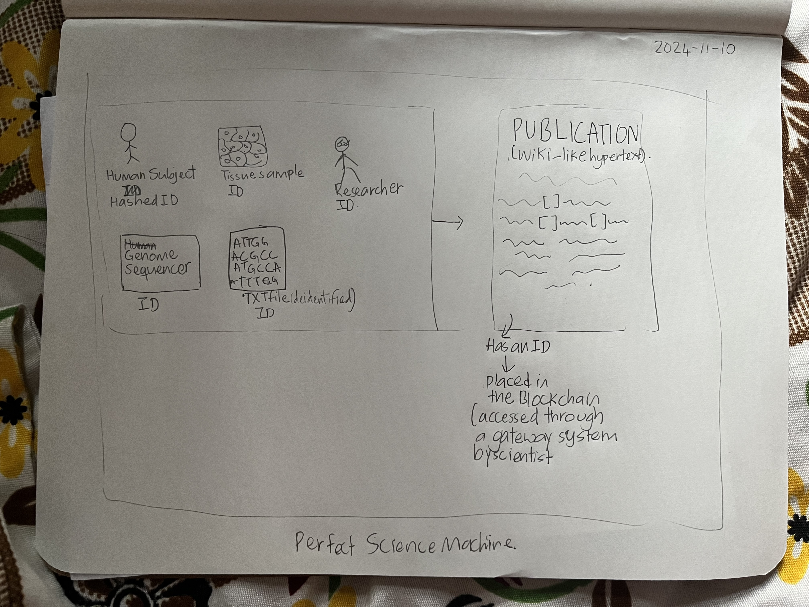
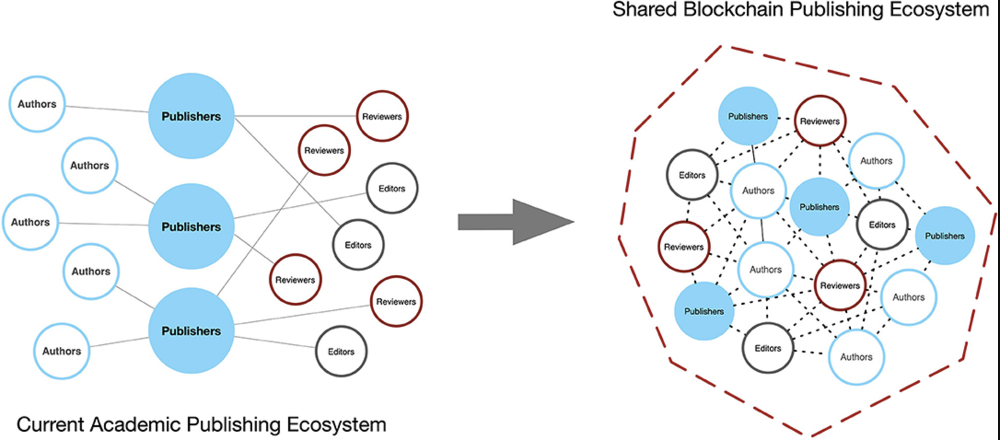

After listening to Prof. Debayan explain blockchain, I started looking for avenues, apart from cryptocurrencies, where such a decentralized system could be used. Previously, as part of a research project, I had spent a considerable amount of time understanding the current scientific publishing ecosystem, only to realize that it lacks transparency and is gatekept by a few companies. Further, the competitive nature of scientific publishing has caused nuanced problems, such as p-hacking, data fudging, and the reproducibility crisis. Since publishing is vital to the scientific process, I wondered if blockchain technology could solve some of these problems.

Through a quick literature search, I came across a paper titled “Blockchain, Wikis, and the Ideal Science Machine: With an Example from Genomics.” The author, David Koepsell, puts forth a novel approach that combines blockchain technology with wiki platforms to develop a “‘science machine’ that folds all processes together, from instrument to publication, enabling science to proceed as never before with greater transparency, accountability, and reproducibility.”

Taking a typical genomics study as an example, the paper proposes a framework in which a unique hashed ID is given to the study’s subject, tissue sample, and deidentified genetic sequencing data, which can be accessed through a private key. The final product—the Wiki-style hypertext publication, which encapsulates the trail of the scientific process from hypothesis and data collection to analysis—is also placed on the blockchain system for the research community to access. Placing publications in ledgers allows the data to be decentralized, preventing the loss of information and monopoly by Western publishing companies and researchers.

_Perfect Science Machine_

However, adapting the blockchain system requires overhauling the current incentive system in academia, since universities rely on the reputation of journals to determine the reputation of scientists before hiring them. Therefore, along with proposing a decentralized system for scientific publishing, there is a need to develop a new system for evaluating the impact of contributions made by scientists.

Democratic Autonomous Organization (Mackey et al.) is one such attempt to retain the essence of the journal-based publishing system (ensuring that players such as reviewers, authors, etc. are retained) while leveraging blockchain technology to improve efficiency and transparency. I do not fully understand the framework, so I have referenced the papers in case anyone would like to deep dive.

_Shared Blockchain Publishing Ecosystem_

Humanity relies on scientific processes to produce an ever-evolving knowledge graph, and there is a need to preserve the knowledge faithfully, decentralize it, while also accelerating the process itself. Blockchain, to me, offers hope.

## Works Cited

1. Koepsell, David. “Blockchain, Wikis, and the Ideal Science Machine: With an Example from Genomics.” Frontiers in Blockchain, vol. 2, Dec. 2019, https://doi.org/10.3389/fbloc.2019.00025. Accessed 9 Dec. 2019.
2. Mackey, Tim K., et al. “A Framework Proposal for Blockchain-Based Scientific Publishing Using Shared Governance.” Frontiers in Blockchain, vol. 2, Nov. 2019, https://doi.org/10.3389/fbloc.2019.00019.