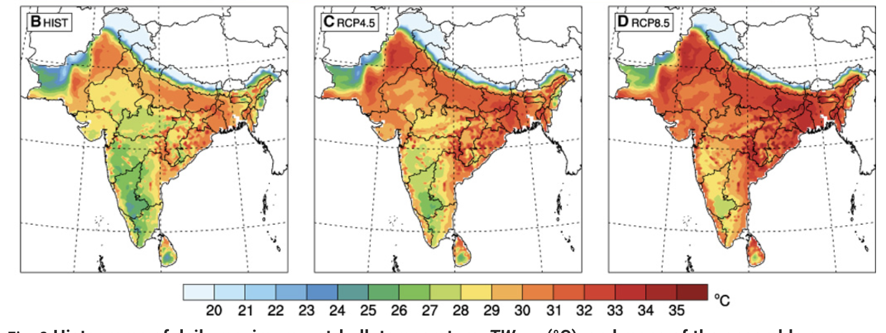

For my final term assignment for the Climate and Geopolitics course at the Young India Fellowship, I was doing some readings about the likelihood of exceeding the maximum wet-bulb temperature (the measure of the combination temperature and humidity) due to anthropogenic climate change. The papers were technical, however, I knew enough scientific jargon to grasp the apocalypse predicted. One of the papers read, “under RCP8.5, a small fraction of the South Asian population (~4%) is projected to experience TWmax [maximum wet bulb temperature] exceeding 35°C by 2100. However, approximately 75% of the population is projected to experience TWmax exceeding 31°C, considered dangerous levels for most humans…” (Im et al.). This made me wonder: Are the people living in the regions-to-be-affected aware of the future they are about to face, let alone be prepared? Worse, “the geographical locations of the most extreme projected heat waves in the Indus and Ganges river valleys coincide largely with locations of highly vulnerable human populations in terms of population density, gross domestic product (GDP) per capita, and agricultural intensity” (Im et al.). How does one even talk about future projections when these vulnerable communities have more immediate problems of livelihood and survival to deal with in the present? 
This made me realise that while climate science, politics, and diplomacy are complex, communicating complexities to a diverse audience is a problem in itself.

## Approaching the Problem of Communication
Putting myself in the shoes of a communicator equipped with accurate scientific information on wet bulb temperatures, I listed my potential challenges I might face in having a dialogue with an Indian audience:

1. Do my audience members have the same perspective and knowledge as me?
2. Considering their priorities, backgrounds, beliefs, and ideologies, why should they be interested in and trust my message?
3. How can I explain this concept while maintaining its complexities without resorting to technical jargon? 
4. Furthermore, how can I address the linguistic diversity present in the Indian population?
5. To understand how to address these challenges, I set out on running an experimentation and reading marathon.
## Mini-Ethnographic Study to Know the Audience: Asking ‘what do you know about climate change?’ 

Addressing the first challenge. Over a week, I asked every person I interacted with one question: What do you know about climate change? By every person, I mean my roommate, my father, my best friend, my colleagues, the housekeeping didi, the reception didi, the printer bhaiya—whomever I met. 

The motivation to ask this question was simple. We assume that almost everyone of us would have heard about climate change. While that is majorly true, what they understand of it varies significantly. Take for example, my roommate. She says climate change is increasing in global temperature and change in weather patterns, and is happening because of ozone depletion caused by carbon dioxide emissions. On the other hand, my best friend attributed climate change to pollution and deforestation. Although some of what they said was in the right direction,  none of them understood what climate change meant—the long-term shifts in the global average temperature and weather patterns due to human activities, mainly carbon emissions. There was also a tendency to muddle other related issues such as pollution, deforestation, urbanisation, along with climate change.

When I asked the same question to people who may not have had exposure to formal education, the responses were different. The receptionist didi said she had heard of Jalwayu parivartan in school, but she did not remember what it meant. The housekeeping didi, on the other hand, had never heard of climate change at all.

Since I brought up climate change in conversations without prior notice, which might have taken people aback or made them conscious, the inferences from this mini-ethnographic study of mine should be approached with caution. However, it is still true that people’s responses varied diversely. Yale’s Program on Climate Change Communication reports that “54% say they know either ‘just a little’ about global warming or have never heard of it, while only 10% say they know ‘a lot.’” (“Climate Change in the Indian Mind, 2023”). Of course, this is not to call anybody stupid or ignorant. In fact, all the people I spoke to were experts/skilled in their own fields. Therefore, the fundamental problem of communication is, given the varying degree of climate change knowledge, how does one communicate a more relatively complex concept such as wet bulb temperature?

One possible solution would be having skilled and trained communicators initiate by first ‘knowing their audience’ and then contextualising the explanation of the concept. Furthermore, asking audience questions to prompt them to recall their lived experiences helps, too. For example, I asked many folks if they had experienced extreme weather events. My roommate brought up the unnatural winters in her hometown and the receptionist didi spoke about a 1995 natural disaster in Haryana. Building on this experience to explain anthropogenic climate change consequences would become relatively easier in most cases.

However, gauging the audience’s prior factual knowledge is the first step. While engaging, a communicator has to navigate the attitudes about climate change, which is shaped by various socio-political factors. This leads us to the second challenge.

## Narratives about Climate Change: Influence of people’s beliefs, values, and ideologies
In a country as diverse as India, attitudes are shaped by factors such as geographical location, religion, belief systems, literacy, and political views. Naturally, it is challenging for communicators to understand the specific socio-political background their audience comes from. Since research shows that people need to understand climate change as a narrative, containing their own language and shaped by their own values and experience, how can one effectively ground themselves to their audience?

After conducting a literature review and parsing through many climate communication research based in the Global North, I finally found a report by Climate Outreach containing India-specific recommendations to weave climate narratives. In their report on Communicating Climate Change in India, they document “the language around climate change and renewables that speaks best to the values and identity of people across India—a country chosen because of its critical importance in the world of climate change. [The report] explores the attitudes of a wide range of people: urban professionals, remote farmers, people of progressive and conservative political values, and the young people who will determine the future of the country.” (One drawback is that the research participants are all from North India.)

Some interesting recommendations from the report (Communicating Climate Change in India) that caught my attention were:
- Reflect national pride in India as a country that is overcoming challenges and on a journey of improvement.
Present climate change as damaging our connection with nature.
- Use concern about pollution as the key entry point for starting the public conversation. (stress the distinct role of carbon pollution in causing climate change.
- Present fossil fuels as polluting (rather than "dirty"), finite and imported. By contrast, present renewable energy as clean, unlimited and a proof of Indian self-reliance.
- Place renewables within a wider narrative of Indian natural abundance and diversity.

Not to mention, climate change communication has become even more difficult in the digital post-truth era, where the information diet of people is restricted to their echo chambers. Combined with the socio-political factors, digital information spaces have become a fertile ground for myths, misinformation, and conspiracy theories to propagate. Therefore, as mentioned by Dr Ashish Jha (Dean of the Brown University School of Public Health) in a recent talk at Ashoka University, there is a greater need for communicators and researchers to go out of their science echo chambers and engage with that of, say, conservatives, or religious leaders, and have an empathetic and open dialogue about socio-scientific issues such as climate change.

## The Language
Finally, the challenge of language. India is linguistically diverse with 122 languages and several dialects (“Protecting Language Diversity in India”). However, when it comes to terms related to climate change, there are no direct translations. Even if translations exist, they are not colloquially known. In my case, not knowing fluent Hindi, I ran into an issue explaining to the housekeeping didi about climate change. Eventually, I resorted to using an AI tool to translate the definition of climate change to aid my conversation with her. Similarly, I tried to write about climate change in my native language—Kannada—and failed miserably. Since the communities vulnerable to experiencing maximum wet bulb temperatures are not English-speaking background, there is a greater need for more regional language communicators in India who can balance the complexities of climate change without using obscure native language phrases.

However, even while communicating in English, there are several hurdles. Often, as communicators, one has to think about the framing of explanations and nuances to omit in order to avoid information overload. It is also essential to communicate uncertainties in the scientific understandings without leading to unhealthy doubt in the scientific process. One useful tactic is to shift from an ‘uncertainty’ to a ‘risk’ framing, which also makes it easier for people to weigh up the costs and benefits of inaction, rather than getting stuck in the perception that knowledge is still imperfect (Corner et al.). For example, “approximately 75% of the population is projected to experience TWmax exceeding 31°C, considered dangerous levels for most humans…”, the risk is directly communicated impactfully.

## Conclusion

Fig. (B to D) The spatial distributions of bias-corrected ensemble averaged 30-year TWmax for each GHG scenario: HIST (1976–2005) (B), RCP4.5 (2071–2100) (C), and RCP8.5 (2071–2100) (D) (Im et al.). I would like to end the essay with these maps predicting a hot and humid future. They show that almost all of India would experience maximum wet bulb temperature at least once if the emissions are not curbed or only moderately mitigated (Im et al.). I cannot help but stare at this grim future and feel frustrated that not many people in my country know what the future holds for generations to come. However, a slow but steady progress towards dialogue-based open climate communication in the Indian context, backed by social science research offers hope. Modifying this famous quote by Sir Mark Walport (ex-director of Wellcome Trust UK), “Science is not complete until it is communicated”, I would say the climate crisis will never be solved until it is communicated.

## Works Cited
“Climate Change in the Indian Mind, 2023.” Yale Program on Climate Change Communication, climatecommunication.yale.edu/publications/climate-change-in-the-indian-mind-2023/toc/2/.

Communicating Climate Change in India. climatenetwork.org/wp-content/uploads/2020/11/climate_outreach_can_-_global_narratives_india4.pdf. Accessed 2 Mar. 2025.

Corner, Adam, et al. A PRACTICAL GUIDE for CLIMATE CHANGE COMMUNICATORS. reefresilience.org/wp-content/uploads/Corner-et-al.-2015-The-Uncertainty-Handbook1.pdf. Accessed 2 Mar. 2025.

Im, Eun-Soon, et al. “Deadly Heat Waves Projected in the Densely Populated Agricultural Regions of South Asia.” Science Advances, vol. 3, no. 8, Aug. 2017, p. e1603322, https://doi.org/10.1126/sciadv.1603322.

“Protecting Language Diversity in India.” Pib.gov.in, 17 Feb. 2017, pib.gov.in/newsite/printrelease.aspx?relid=158532.
