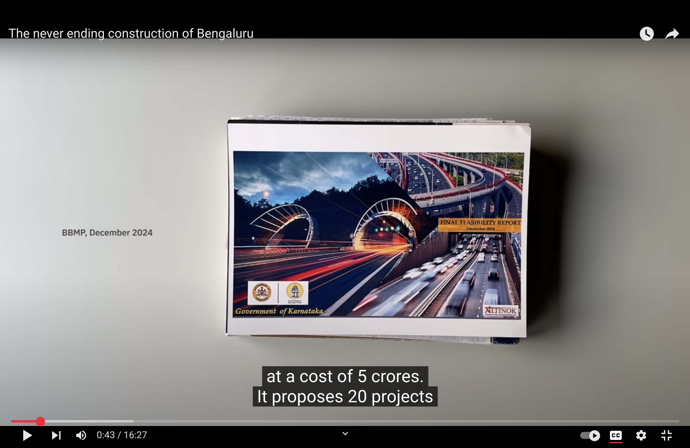
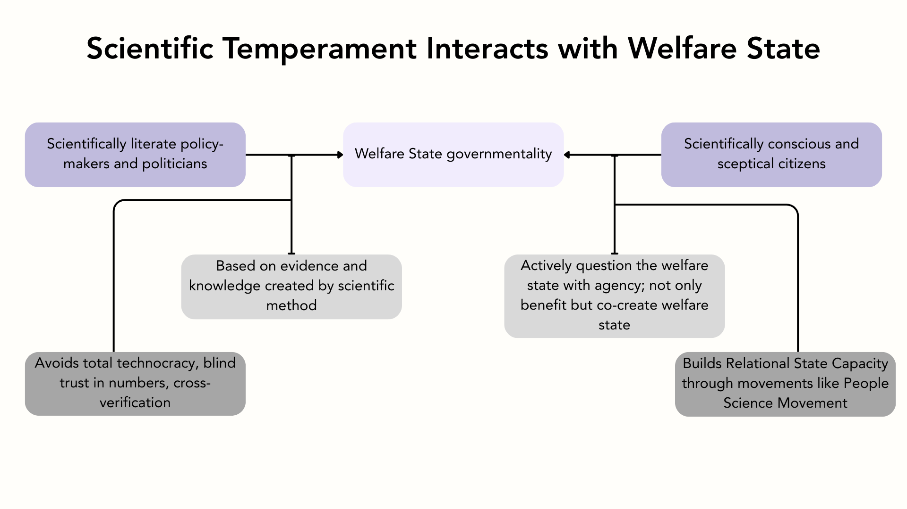

Most rhetoric about the welfare state revolves around the mechanics and politics of schemes related to social protection, social assistance, and social rights such as—education, healthcare, food, and employment. However, abstracting our way out from this detailed perspective and instead looking at the Welfare State as a whole, we realise that “the welfare state is a distinctive form of governmentality: a specific mode of constituting the economy, assuring social security, and guaranteeing social provision (Garland, D., 2014)”. In this essay, I argue that scientific temperament should be one of the core pillars—if not the pillar—of this form of governmentality. 

## Scientific Temperament: How Does It Interact With the Welfare State?
A term embedded in Indian discourse on science and science popularisation, scientific temperament was first used by Jawaharlal Nehru in The Discovery of India in 1946. Nehru writes, 

“The applications of science are inevitable and unavoidable for all countries and peoples today. But something more than its application is necessary. It is the scientific approach, the adventurous and yet critical temper of science, the search for truth and new knowledge, the refusal to accept anything without testing and trial, the capacity to change previous conclusions in the face of new evidence, the reliance on observed fact and not on pre-conceived theory, the hard discipline of the mind — all this is necessary, not merely for the application of science but for life itself and the solution of its many problems…(Jawaharlal Nehru, 1946, p.512)”

Furthermore, Kankaria argues that ‘scientific’ in Nehru’s scientific temperament is:

“akin to a mathematical function that operates on input variables in order to yield specific outputs. The input variable here is active citizen participation in knowledge-building, which can then lead to the output of an independent, postcolonial state that is freed from the shackles of dogmatic views, superstitions and pseudoscience (Kankaria, S., & Chakraborty, A., 2024).”

Scientific temper is now added to the  Indian Constitution in 1976 under Article 51A(h), which declares developing of the scientific temper, humanism and spirit of inquiry and reforms as one of the ten fundamental duties of every citizen (Kankaria, S., & Chakraborty, A., 2024). At this stage, it is also important to note that this “broader national, social and humanistic context” (Kankaria, S., & Chakraborty, A., 2024) to scientific temperament framed in the Constituion consciously avoides the scientistic framings sometimes found in STEM rhetoric. 

A State where its “citizens actively participate in gaining both scientific temper and knowledge and its institutions actively promote this process (Kankaria, S., & Chakraborty, A., 2024)”, enables building of two crucial actors for its welfare state: 
Scientifically conscious and sceptical citizen communities. 

Scientifically literate policymakers and care workers I argue that these two actors working in tandem build a welfare state which constantly betters itself through an iterative process of questioning and improving.

## Scientifcally Conscious and Sceptical Citizen Communities
Scientifically conscious citizens, as mentioned before, are actively participating in gaining scientific temper and knowledge. I envision them as critical thinkers who do not simply benefit from welfare schemes, but actively attempt to question and learn about them. Most importantly, they integrate the scientific knowledge with that of their lived experiences and knowledge. For example, when the government of India launched Digital India initiative—with the vision to transform India into a digitally empowered society and knowledge economy (About Us—Digital India)—critical questions that a scientifically conscious citizen would ask include: 
- What problem is Digital India solving? 
- What are the potential problems that Digital India might inturn bring? 
- hom does the initiative benefit? 
- Are the majority of citizens digitally literate to transition? If not, how should one bring about digital literacy?

When questions like these become part of the everyday, the collective consciousness (and unconsciousness) of citizens is more critical, leading to greater accountability by the government and even co-creation of welfare schemes.
However, an ideal scientifically conscious citizen is a rarity. India poses unique challenges in terms of diversity in religious beliefs, ideologies, leading to prevalance of misinformation, pseudoscientific claims, and conspiracy theories. The lack of scepticism negatively impacts welfare state as one can easily fall for false claims. For instance, recently, a scam advertising a fictitious government job to entrap potential victims was reported (Sharma, 2025). A non-sceptical citizen easily gets lured by such traps.

## People’s Science Movement
In order to build a State with scientifically conscious citizens, momentum needs to be built  starting from the grassroots. Since 1960s, “the People’s Science Movement has worked to democratise the generation of knowledge and its dissemination and integration in Indian society, centring the sociocultural consciousness of the Indian people (How the People’s Science Movement Is Bringing Joy and Equality to Education in Karnataka, India, 2024)”. Given the neolibearal forces reducing science education to producing cheap technical labour forces, People’s Science Movement is a ground-up initative set up by teachers, science experts and blue collar workers to instill critical thinking and scientific temperament in government school students and wider public. They host several nationwide programmes such as Joy of Learning (1994), Cosmic Voyage (1995), People’s Reading movement — Jan Vachan Andolan (1995), International Year of Astronomy (2009), Surya Utsav (Solar eclipse festival) (2019) to a communicate aspects of modern science in an easy to understand manner. Intersecting more closer with the welfare state, People’s Science Movement in Kerala helped stop the construction of hydroelectric dams in Silent Valley of Kerala. Similarly, People’s Science Movmeent has played a crucial role in communicating the short-term and long-term risks of Bhopal Gas Tragdy. More recently, they worked on helping farmers unwrap the complexities of Genetically Modified Crops in resisting companies like Monsanto investing in pesticide resistant GM-crops, as pests (a biological being) can always evolve to counter the resistant crops (T. V., 2020).

Movements such as these, also help indirectly in building Relational State Capacity as it boosts and strengthens everyday interactions of citizens with agents of the State. However, such movements are at a threat as the State is being shaped by neoliberal forces. As mentioned by T.V., critical sectors like health, education, and social welfare as part of its neo-liberal agenda are increasingly being left to ‘corporate social responsibility’ and “people’s Science Movements are finding it difficult to appeal to the moral economy to entitle and empower impoverished people  (T. V., 2020).”

## What A Scientifically Conscious Citizen Can Do?
A more positive example of a citizen critically questioning the welfare state is that of a YouTube creator called Bengawalk. The author has called out several of Bruhat Bengaluru Mahanagara Palike’s (BBMP) project including the Metro infrastructure and the never-ending road construction in the city. In the video on the road construction in Banglore, he digs up the Final Feasibility Report, which has proposals for 20 road construction projects. He points out that this report (on which BBMP spent 5 crores) has no budget allocated to make pedestrian infrastructure or to enhance public transport. 

_Fig. Still from the video on road constructions in Banglore_

Later in the video, the author touches upon the root cause of this road problem: the lack of elected municipal council for many years. Worse, the executive bodies are numerous but do not function complementarily leading to unresolved conflicts on policies. With no body making policies for the benefit of people, who is to stop polling of crores of money going to illogical and unscientific development of cities, which benefits the rich few at the very most?

All citizens must be empowered to ask such questions to the State like Bengawalk. However, citizens can develop an agency only if policymakers—who are on the other side of the equation—are also equally scientfically literate (and exist in the first place).

## Scientifically Literate Policymakers
Going back to one of the earliest welfare states, the U.K., we can see that Beveridge’s and Chadwick’s reports were very much grounded in the latest science of their present. For example, although incorrect, the miasma theory had an influence on health policies and the eventual birth of National Health service in the post-war Britian. Sadly, we do not find the same kind of engagement with science and research by politicians and bureaucrats in India anymore. For example, during the pandemic, instead of building good public health infrastrucutre, our prime minister diverted the public’s attention and asked the citizens to bang plates in gratitude towards the healthcare workers. How can citizens exercise scientific temperament if the top leaders spread false information and claims? And it is these very political leaders who continue to constrain funds for research and development. India spends only 0.6-0.7% of its GDP on Gross Expenditure on Research and Development (GERD). This leads to further decrease in scientific knowledge and temperament of the country.

However, one must also be cautions about what science claims the policymakers choose to believe in. Take Beveridge’s association with Eugenics society. There is always a danger for an unscientific conclusion to almost sound “scientific”. And this is where the partnership between the citizens and policymakers comes into foreground. Through working in tandem, both actors can keep each other accountable, build relational state capacity, and prevent the derailing of ideas and policies.

## Conclusion

_Fig. Relationship between Scientific Temperament and Welfare State_

If policy makers are scientifically literate and informed, the welfare state governmentality would be based on evidence and knowledge created by scientific method. On the other hand, a scientifically conscious and sceptical citizens would not only benefit from welfare state, but can co-create the welfare state. In a utopian society that is scientifically tempered (in accordance with Nehru’s vision), I see a welfare state that has a healthy balance of scepticism, social security and vision for economic development. I hope the said utopia becomes a reality.

## References
About Us—Digital India | Leading the transformation in India for ease of living and digital economy | MeitY, Government of India. (n.d.). Digital India | Leading the Transformation in India for Ease of Living and Digital Economy | MeitY, Government of India. Retrieved April 13, 2025, from https://www.digitalindia.gov.in/about-us/

Banging thalis will not defeat coronavirus – we must build a quality public-health system to do that. (n.d.). Retrieved April 13, 2025, from https://scroll.in/article/956918/banging-plates-will-not-defeat-coronavirus-we-must-build-a-quality-public-health-system-to-do-that

Bengawalk (Director). (2025, March 31). The never ending construction of Bengaluru [Video recording]. https://www.youtube.com/watch?v=lV7s_aks_4A

Beware of this fake government job scam. (2025, March 17). India Today. https://www.indiatoday.in/india/story/fake-government-job-ads-gramodyog-rojgar-yojana-ministry-of-labour-and-employment-2694768-2025-03-17

Garland, D. (2014). The Welfare State: A Fundamental Dimension of Modern Government. European Journal of Sociology / Archives Européennes de Sociologie / Europäisches Archiv Für Soziologie, 55(3), 327–364.

 How the People’s Science Movement Is Bringing Joy and Equality to Education in Karnataka, India. (2024, February 13). Tricontinental: Institute for Social Research. https://thetricontinental.org/dossier-73-peoples-science-movement-karnataka-india/

Jawaharlal Nehru. (1946). The discovery of India. Meridian Books, 22.
Kankaria, S., & Chakraborty, A. (2024). Scientific temper: Towards an alternate model of science-society relationships. Journal of Science Communication, 23(4), Y03. https://doi.org/10.22323/2.23040403

T. V., V. (2020). ‘Science for social revolution’: People’s Science Movements and democratizing science in India. Journal of Science Communication, 19(6), C08. https://doi.org/10.22323/2.19060308