Oh my gosh, what a whirlwind of a week! There were so many firsts: big personal crisis, Christmas celebration, therapy session, family dinner. I cannot even begin to describe them. I have learnt so much about life, myself, fate, and choices.

One main takeaway was on trust. Trust is personal and intuitive, but it is also a funny phenomenon. Your intuition can never always know when it breaks. Neither can you not trust anyone, nor can you blindly trust everyone. How to ensure people do not deceive the trust? I thought my intuition had honed enough to avoid tricky situations, clearly not. In this semi-public journal, I do not yet feel comfortable sharing the personal incident from the week.

Instead, I will attempt to capture my first-ever Christmas celebration experience. 

The week started with the Royal Institution’s Chemistry of a Candle lecture I attended with Wannes. Wannes made for a really good company, and the lecture was engaging and informative, almost theatrical. It felt like I was attending a magic show, disguised as a science lecture.

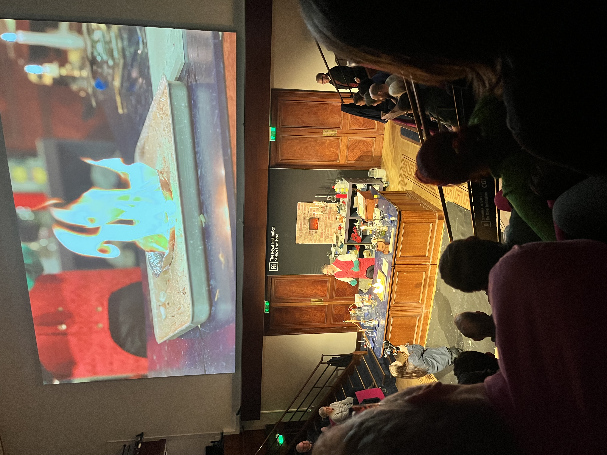

_Chemistry of a Candle Lecture demonstration_ 

Karin, whose lovely home I live in, decided on the morning of 24th December that we should get a Christmas tree and decorate home. Although I had barely slept the previous night, I tagged along. We walked past The Department Store to reach this street Christmas tree vendor. We were on a lookout for a small tree, but we only saw were three giant trees left. But, to our utter surprise, the vendor said they were free! Without wasting a minute, we chose the smallest of the three and started carrying it back home. Not having partaken in many attention-seeking activities, I felt out-of-place, but not for long. Karin started telling people how we procured the tree, sharing laughter with people. As I was starting to feel tired, we met Dan at the signal. I handed the tree over and became the spectator of this event myself.

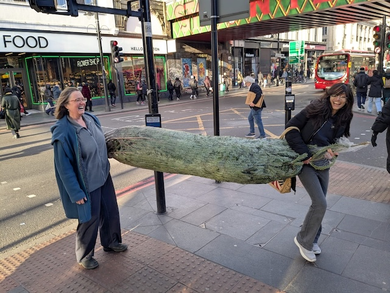

_Karin and SNH carrying the tree home_

After getting the tree home, we immediately got to decorating. We gathered baubles and lights. We chopped off the tree to fit the stand, and opened the tree up. The tree looked like an archetypal Christmas tree; was absolutely beautiful. After many deliberations on where to place each piece of decoration, we were finally done by early evening. It was soon time for our first Christmas eve dinner with Karin's old friends. The pie the guests had made was wonderful; the best I have eaten. Karin's potato salad was nice as well. The conversations were enjoyable, although it revolved mostly around British politics, literature, and theatre. My knowledge in all three of these domains isn't the best, I admit. Tired, I slept early.

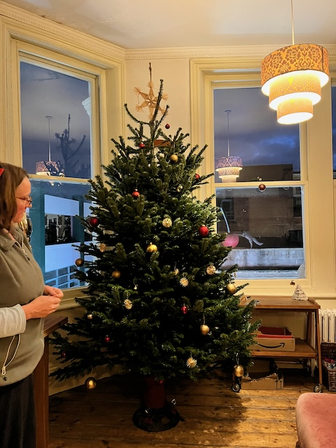

_Decorating the Christmas tree_

I woke up for a bright sunny Christmas day.

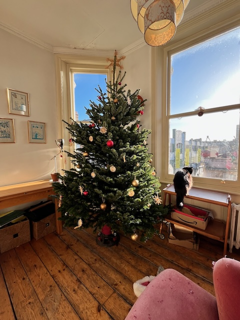

_Christmas Tree and BoyCat_

Presents had appeared magically under the tree. I contributed mine. We opened them in the morning together. Karin and Dan gifted me two wonderful books: Anne Tyler's _The Accidental Tourist_ and George Orwell's collection of essays. I sat for a little longer after opening gifts to soak in the sun, enjoy my black coffee, listen to some Mozart, and read one of the books.

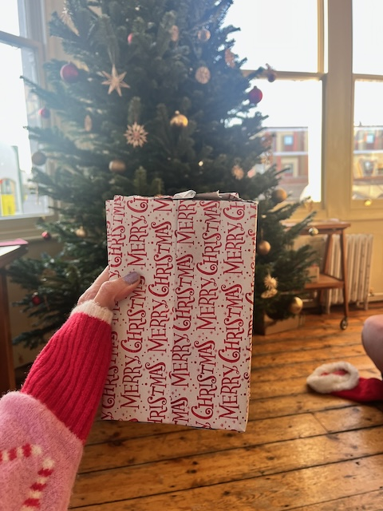

_SNH's Christmas presents_

I wish I could sit, listen and read forever, but I had agreed to help make Mince Pies. We all gathered downstairs in the kitchen and slowly set up an efficient production line. I mostly filled the mince meat into the pastry Karin rolled. Dan added the top layer and egged them. Then, all we had to do was to wait for them to bake in the oven! With lovely Christmas music in the background, it made for a relaxing communal activity.

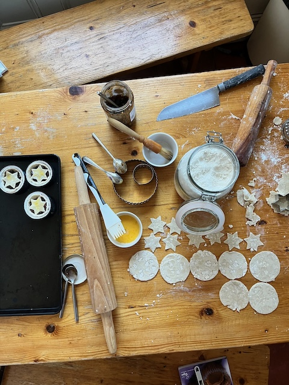

_Making of Mince Pies_

We left home immediately after. Karin and Dan were going to a friend's place for their Christmas meal and so was I. Since public transport was shut on Christmas day, we drove into Central London. London was so scenic, basking in the winter sun. After they dropped me off, I walked through Russell Square, past the British museum, to reach my friend's place. The walk was one of the those moments, which made me extremely aware of where in the world I was. In London, all by myself, doing my Master's.

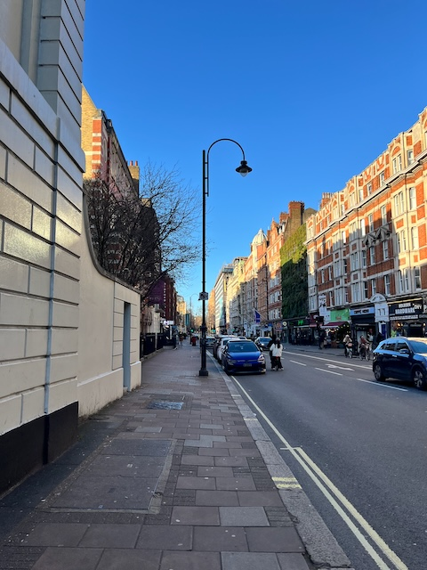

_A random street in Holborn_

I had lunch at my friend's place, which was quite nice. I also made more friends. I wrote to some close people, but had to leave the friend's place after the incident. Luckily, Karin and Dan picked me up on their way back. I was extremely anxious and sick given what had happened, but being around them really helped. We took the Waterloo bridge back and got to see all the popular attractions including London Eye, St. Paul Cathedral, etc.

26th December, I fully crashed. I was at my lowest as I processed the incident at my friend's place. I spoke to Arushi first. But, I finally decided to reach out for support and speak to a counsellor. I am glad I did. I spoke to this lovely Columbian lady who patiently listened to me, asked meaningful questions and offered advice. It is because of her that I know see the incident as life's learning lesson rather than still agonising over it. The only bright moment from the day was when I made myself omelette for the first time.

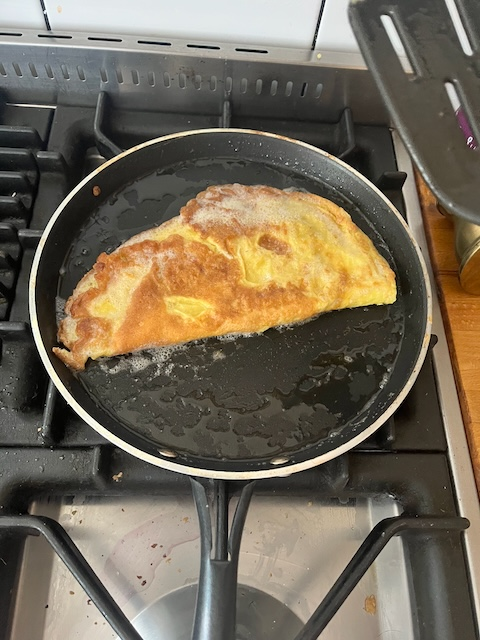

_Omelette; less oil next time_

27th December, I felt better. In the afternoon, Karin, Dan, and I started preparing for our second Christmas evening dinner. Like before, we had Christmas music playing in the background as we made roasted potatoes, Brussels sprouts, red cabbage, parsnips, and cauliflowers. We also prepared our very own mulled wine. The meal was delicious, and we concluded with Colins, The Caterpillar.

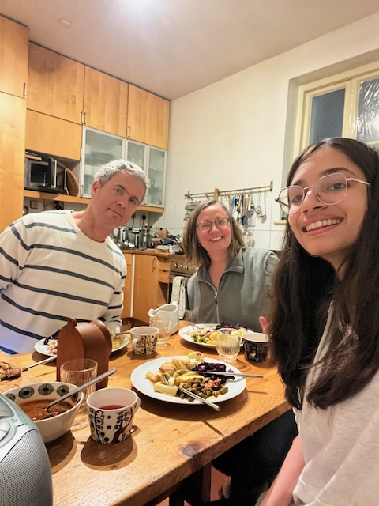

_Second Christmas Eve dinner with Karin and Dan_

Karin, GirlCat, and I curled up in the sitting room for a while to relax after the meal. We discussed the new house, life, for a bit. But for most part, I read _The Accidental Tourist_ (which I am loving) and Karin played her farming game. Finally, in the evening, we made more mince pies before heading to bed.

<img_src = "IMG_9415.jpeg">

_More Mince Pies being made_

28th December, my brain woke up in the morning and decided it was time for some solo exploration.

I spent the morning setting up my Jewelry stand (thank you Secret Santa). I adore my collection; I am glad I got the stand.

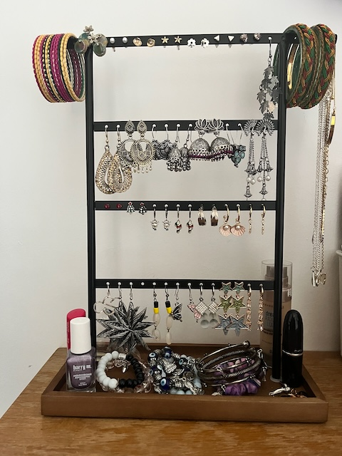

_Jewelry stand_

Late afternoon, I made my way to Wellcome Collection. I explored the _Thirst_ exhibit first.

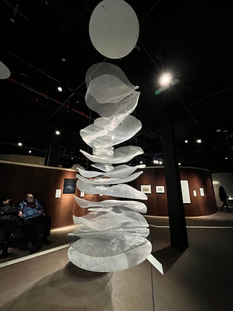

_Thirst exhibit. Depicting Gurgaon's Ground Water table_

Later, I headed to the Reading Room where I spent a few hours catching up with people and organising life. 

At 1800, I took the bus to Southbank Centre Christmas market. The bus took the same Waterloo bridge. I got down at the end of the bridge, made my way down a shady walkway to get to the riverside market. I immediately liked the vibe. People were enjoying themselves, the stalls were warm and cosy, the views of the river and city were stunning, and the music was familiar and good. I felt grateful to be there. I got myself a hot chocolate and wandered till the end. Later, I sat in front of the London Eye, wrote and reflected on the long-but-rewarding year. I felt very proud that I was finally in London. I realised this is what I dreamed of, and I am living it however imperfectly.

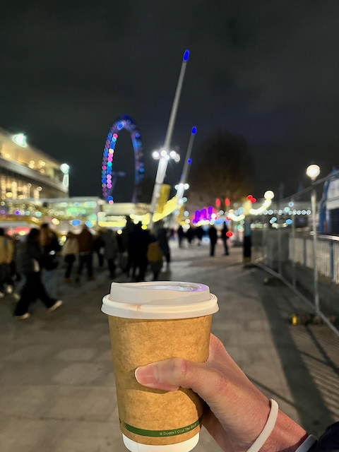

_Hot Chocolate at Southbank Christmas Market_

I took the walking bridge making it back to North. Incredible views.

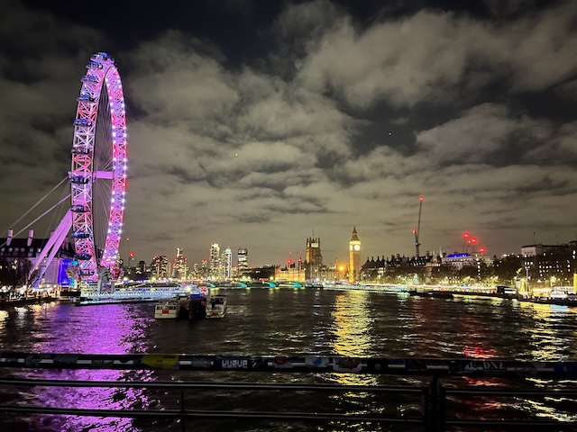

_London from Waterloo bridge_

After a quick pit stop at Trafalgar Square (disappointing Christmas tree honestly), I came back home. I had Karin's amazing potatoes and red cabbage and called it a day.

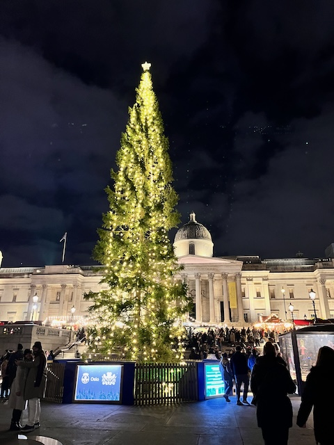

_Trafalgar Square Christmas Tree_

Between spending time with Karin and Dan, therapy, and going out, I started to feel better, gained back the confidence I had lost in myself. I am still a work in progress, but we are getting there.
