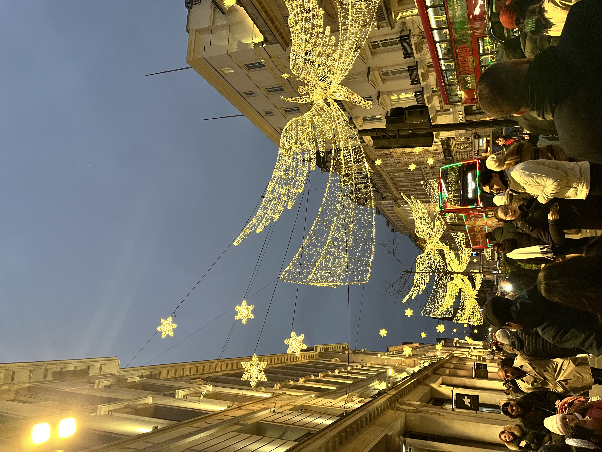
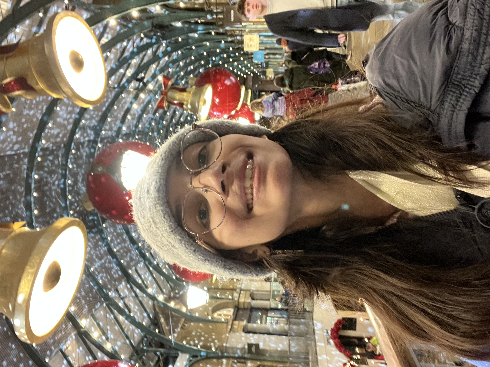
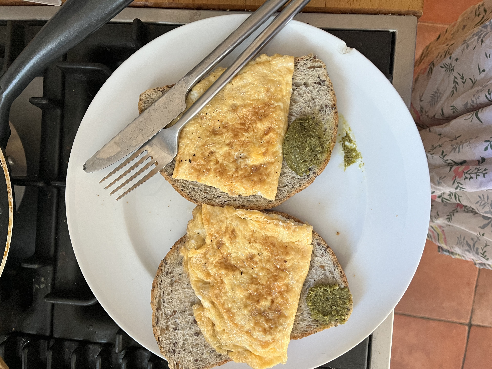
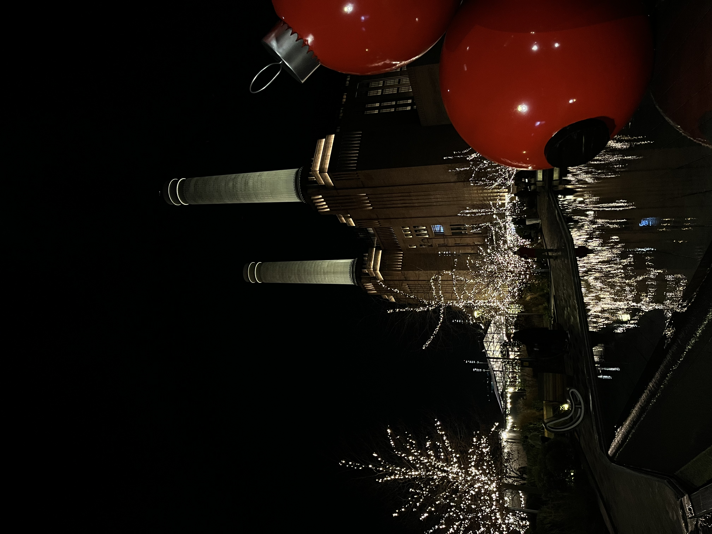
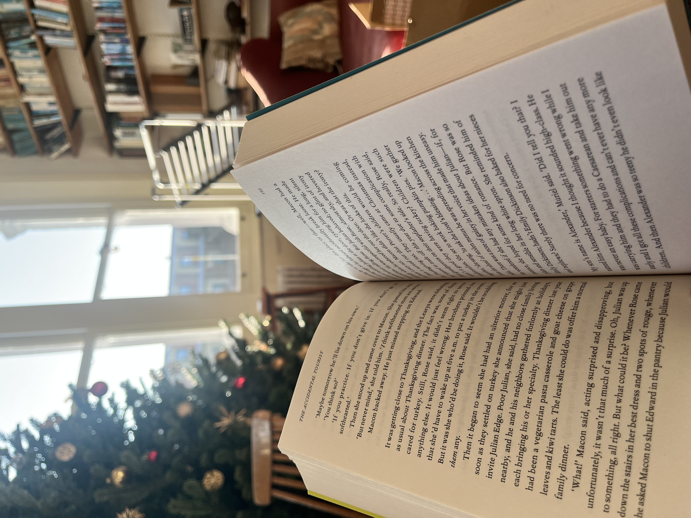
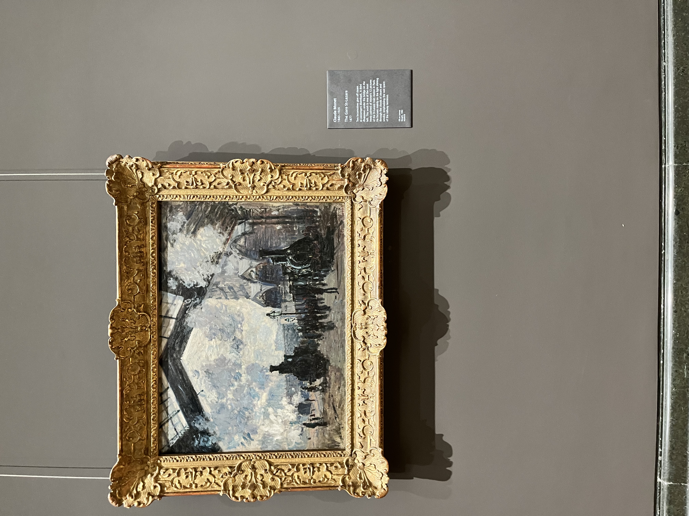
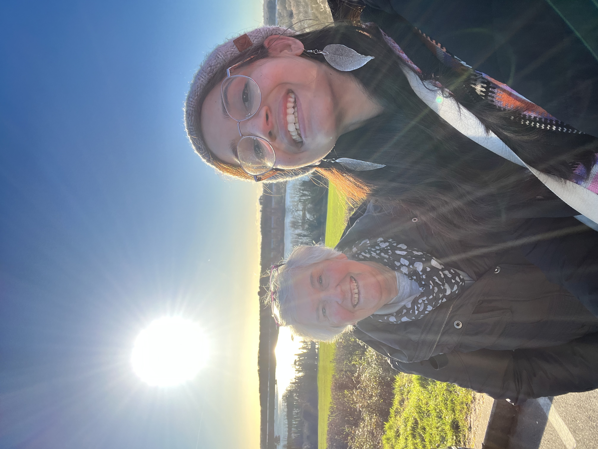
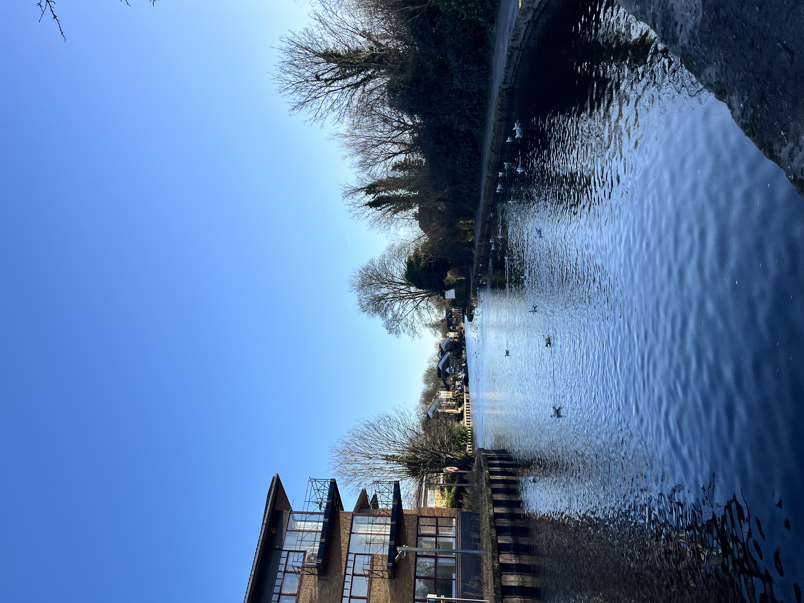

Week 14 probably was the first time I fully enjoyed being in London. From visiting more Christmas markets to having a relaxed New Year’s Eve, I felt very refuelled by the end of the week.

## 2025-12-29

I hosted Chandana, a Chevening scholar from Mysore, at my place. She was a bit jittery, as she had just left her family. We went to Central London to see Christmas lights. I took her to Regent’s Street, which has my favourite Christmas lights.

_Regent Street Christmas Lights_

We got to sit in the front row of the double-deck bus to see the lights! We also walked the Oxford Street. She left earlier than expected, but I made my way to Covent Garden Christmas market. The market was extremely crowded; interestingly, I wasn’t bothered by it. The tree and the bells were magnificent. The independent stores outside the market and the stalls in the market were cute as well. I got some socks for Wannes, Arushi and me. I also got myself these leaves earrings (now that I think of it, I should have bought the golden ones instead of silver, oh well). What I enjoyed the most was the vibe and live music. I sang my heart out and it felt really really good!

_Covent Garden Christmas Tree_

_Me and Bells_

I wished Karthik for his birthday. He is managing okay, I think.

## 2025-12-30

_Me in morning sun at home, Electric Avenue_

As usual, I had my omelette and left for Wellcome Collection Reading Room in the afternoon. 

_My new staple food: Omelette_

_My new fav workspace: Wellcome Collection_

After a productive reading and writing session, I left to see the Battersea Powerstation Christmas market. Firstly, I was surprised by how un-London like Battersea felt. The whole urban design and infrastructure looked modern and Singapore-like: high rise apartments, urban community spaces, etc. The market itself was scattered and small. I wandered through the mall and spent the most time at the grocery store. However, towards the end of the day, I started feeling a bit jittery because the experience felt too new to me. In the end, I was glad I was back at a familiar place: home.

_One of the Christmas Trees at Battersea Powerstation_

_Christmas Decorations and Battersea Powerstation_

## 2025-12-31

New Year’s Day has always been a day where I don’t do anything. I read the book all morning.

_Reading book in the sitting room_

The Accidental Tourist has been absolutely wonderful! This book is exactly what I needed: the imperfections of human condition portrayed beautifully through fiction. The story also feels relatable. The book follows a divorced man who has lost his son. He embody’s me in wanting to have a system, desiring to have structure in life. His divorce also happens simply because it happens. In his case, there is no big fight or misunderstanding between him and his wife. They just fall out over time. This is how my relationship with K. ended too. Even if I wreck my brain, I cannot think of one concrete reason for breaking up. There was no big fight, hatred, nothing. It happened.

Getting back to my day. I spent the afternoon with Arushi. It was one of the most wholesome conversations we have had in a long time. We asked each other questions which she had found on Instagram. It is insane how well we know each other. Whenever she said something about me, I was vigorously nodding head, and I believe she did the same, too. One things that stood to me was how we react when we are angry. She said, I am a placid lake (all I do is feel disappointed), whereas she is like falling snow (she keeps ranting like tweety). We also spoke a lot about other fellows, friendship, etc. Three hours passed; we could have spoken for many more hours.

I spent the evening reflecting and planning, which made me feel more in control of my life. I felt more hoepful by the end of it. Karin, Dan, and I celebrated the evening by making ourselves Brandy Hot Chocolate, watching the fireworks from the window and the screen, and reflecting together.

## 2026-01-01

I woke up fairly late and spent the morning reading the book. In the afternoon, I hosted a friend, Marina. Our home was messy; we are packing up to move houses in the coming month. Marina spent a few hours. We had our first proper conversation after having spent many months in class together. She is fun to talk to! I also learnt about the River Thames wavy nature, which means North and South of London are sometimes adjacent to each other. Mind blown!

I watched Zohran Mamdani take oath. I fell asleep listening to his speech. I had an early dinner and slept.

## 2026-01-02

Yet another day of going to Wellcome after lunch and going out to Christmas markets. One useful accomplishment from the day was that I discovered a course on Impressionism and registered for it. I have fallen in love with Monet and now want to learn more about the art movements of his time. That day, I went to Leicester Square Christmas market, which was very German (limited stalls though). However, want caught my attention was stoneware being sold by this Palestinian man. I got a lovely plate for myself.

Later, I went to National Gallery, which was super crowded. However, I managed to make it to the Impressionist section to see Monet. I also saw Van Gogh while I was there.

I had dinner and slept early.

## 2026-01-03

The day I had been most excited for! Henry, a retired professor from the Chemistry Department at Imperial, had invited me to West London. I was super excited to explore this part of the city!

It took me an hour on tube to get to Greenford. As I moved away from the centre, the landscape suddenly became very rural and unlike London. Henry picked me up from the station. We briefly stopped at his home, picked up Zei, his wife. Both are absolutely wonderful people. From the beginning, they spoke a lot giving me context for everything I was seeing. We drove on M40 to Alperton. The street was so Indian, it even had a temple! Next, we drove to Horsenden Point, which was scenic. I wish we did the hike up, but we had a reservation at The Old Orchard to get to.

We had interesting conversations about sustainability, my board game, and everything else in between as we waited for our food at the pub. The Old Orchard had scenic views of Colne Valley Lake, it was disappointing that we had to sit indoors away from the windows.

_Zei and me outside The Old Orchard_

The food was amazing, I had rice and Malai Curry, Jerusalem Soup, and Bang Bang Cauliflower. After a filling lunch, we did a canal-side walk. I felt so calm and serene. The sun was shining, although my hands were freezing. The canal water flowed slowly. Bird chirped in the background, and banter from Henry and Zei made the experience more lively. The walk was more beautiful than the meadow walk I did in Cambridge I must admit. We even got to see a canal boat using the lock!

_The Canal_

We drove back home passing the M25. Zei had promised to make scones and tea. I stayed around to see the making process. As the scones were baking, Henry and I slipped out to see his park, which had a frozen lake. 

_The lake_

Soon after tea, it was time to go home. I read the book on my way back. I also did some readings for my course before hitting bed.

## 2026-01-04
Sunday was a lazy day. I had underestimated the readings for my Policy course. I spent the morning making notes from my readings. I was supposed to go to Wellcome in the afternoon, but I stayed back to talk to Abhishek instead. We spoke about his book, my Christmas break, and Pralay. I read some more after our call. Arjun cold-called me next. I ended up telling him K’s story and felt very drained by the end of the conversation. We had never spoken about relationships, it threw me off. I hope he didn’t feel awkward. I always worry that I am rubbing off negative emotions to the other person whenever I talk about the break up; it immediately shifts the tone of the conversation for me.

I finished the readings, packed my bag and went to bed.