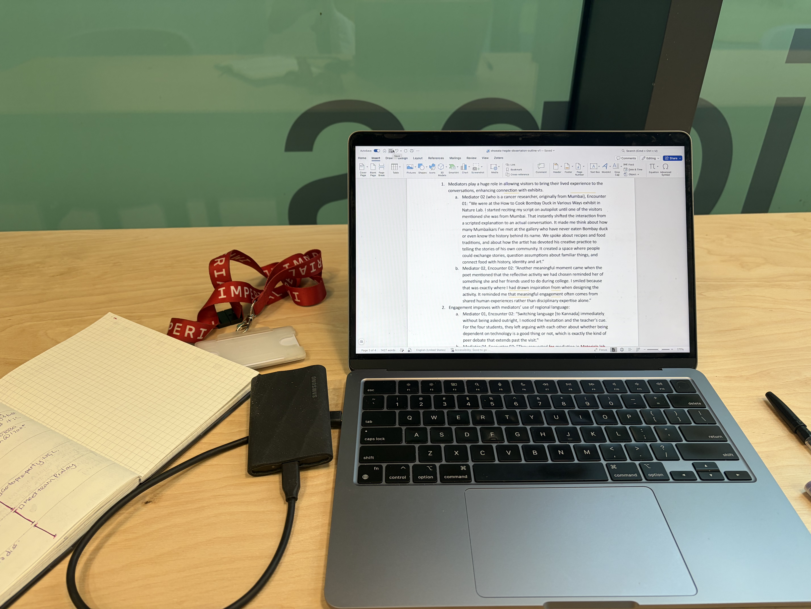

Yesterday was moderately productive. I read and made some initial notes on reflection journal entries. Today, I spent the afternoon revising the chapter outline and working on synthesising my analysis. I really need to do more literature review. I keep telling myself that I should be reading Bourdieu; it's tough reading him! I'm happy I'm making gradual progress. I feel more positive about my dissertation now compared to start of the week.

I worked from White City today (was here for a Society meeting). I found the Student Hub, sat and worked from their cute workspace.

