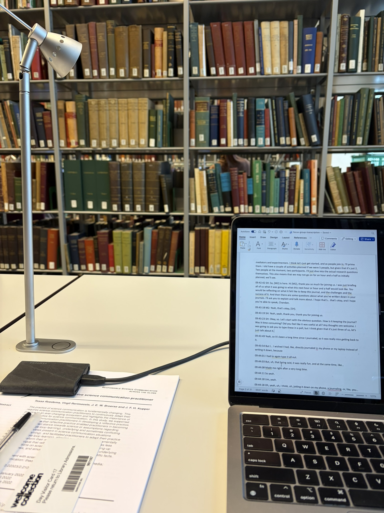

1100

Yesterday was productive! Wellcome library was quite and not crowded. All the reflection entries read. The Forms of Capital read. 20 minutes of the focus group transcribed.

_Working from Wellcome_

I'm glad I read The Forms of Capital; yes, Bourdieu's writing is incredibly hard to read. But, there is no replacement for original. His ideas about cultural capital and social capital is nuanced. It has given me ideas for how I want to frame my arguments in the context of his framework.

Today's goal is to finish transcribing and start the thematic analysis. Lots of work to do. But, I feel optimistic.