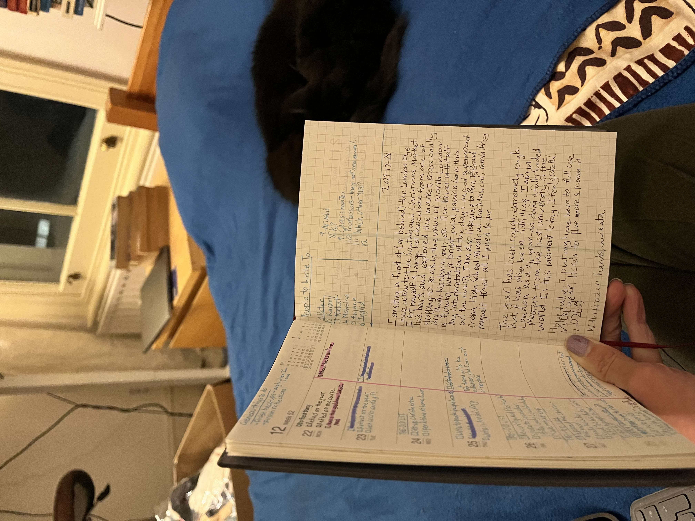

How to describe 2025? It is very difficult to encapsulate the year in words.

Professionally, I have achieved my biggest milestone yet: studying Master's in the UK on a fully-funded scholarship. I am now a student at Imperial studying Science Communication. I successfully completed Young India Fellowship (YIF) with good grades and an award for best project. Both the YIF and Imperial have provided me with the best possible education that a young adult can get. I also had a decently paying job offer in hand I could have taken up. From an outsider's perspective, I am leading an ideal life many dream of. In fact, I am. Life, however, always has catches. In my case, I have several.

My professional path has been nothing but rosy. Sleepless nights, headache-y evenings, 15-hour days, constant stress and anxiety, uncertainty, long waits, family pressure, blood, sweat, tears. Only the closest know the hard work and sacrifices. Personally, life has been chaotic. Missed birthdays, growing distance from old friends, failed relationships, missed outings and socials, growing tension with family. Physical health took a big toll. Every other month I was sick with something. Mental health tanked big time. OCD has progressively become worse to a point that interfered considerably with professional life.

Overall, 2025 was a very unstable year. Highest highs, lowest lows. I would have had a brilliant day professionally, but would come back home and cry, not being able to cook because of obssesive thinking.

Anyway, last few days of 2025, I was finally able to soak in some of the joy of my accomplishments. I was somewhat healthy, well-fed. I explored four different Christmas market, seeing so much of London. I am grateful to be here in a big city by myself, living with Karin and Dan, two lovely cats. Not many 24-year-olds from a small town in India get to live this life.

I am incredibly grateful to people in my life. Peter without whom I wouldn't be here. Karthik and Arushi for their constant support. YIF friends. YIF mentors. Vijay. SciComm community. School friends: YK, Chirag.

Here is a quick reflection I wrote when I was visiting Southbank Christmas Market sitting in front of (or behind) London Eye (with frozen hands).

_SNH's reflection_