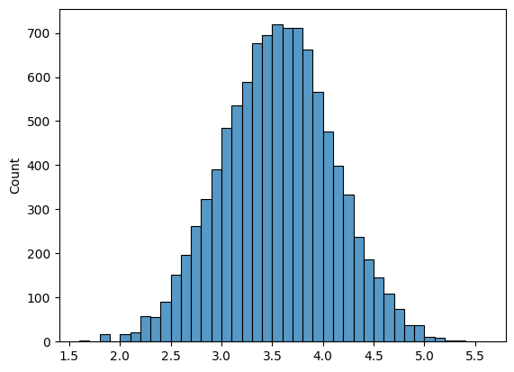

Through the course, I learnt about various statistical tools and concept. But I also explored how to run them in Python. So, it only makes sense for my final report to be an interactive Python file.


```python
# Import packages
from scipy.stats import norm
import matplotlib.pyplot as plt
import numpy as np
import random
import seaborn as sns
```

# Part A
Choose three of the four following statistical tools (A.1 – A.4). For each of your chosen three, write a short response exhibiting your understanding of the tool (250 words maximum each).

## A.1 Normal Distribution
The Bell Curve: _The one curve that rules them all!_

Before we arrive at what a normal distribution is, I'd like you to devise an experiment.

Throw a dice 10 times and note the average. An example outcome would be: `[6 5 2 1 5 4 4 5 4 1]`. The average is `3.7`. Will the averages always remain the same? Would there be a pattern in the averages noted?

Maybe you'd say let's repeat the same process 10000 times. Of course, you wouldn't sit and throw dice 100000, would you? You get a computer to do it.

As you shall see below, I've written a few lines of code to simulate a throw of dice. I've asked it to generate random numbers between 1 and 6 (mimicking throwing a die) 10 times, note the average and repeat 10000 times.

Looking at 10000 data points would be tedious. Instead, let's visualise. A histogram plot reveals that there most of the average is centred around a number (mean) and it is almost symmetrically spread out. How data is spread is given by standard deviation. This type of distribution is a normal distribution. It is also known as a bell curve, or as the professor likes to call it: "The one curve that rules them all!"


```python
rng = np.random.default_rng(seed=2310)
rolls = rng.integers(low=1, high=6, endpoint=True, size=(10_000, 10))
sns.histplot(data=rolls.mean(axis=1), binwidth=0.1)
plt.show()
```


    

    


```python
rolls_sort = np.sort(rolls.mean(axis=1))
rolls_mean = np.average(rolls_sort)
rolls_std = np.std(rolls_sort)
```


```python
norm(rolls_mean, rolls_std).cdf(4)
```


    0.8176661208472158


We find normal distributions everywhere. Height and weight distribution in a class, people's shower time, etc. Knowing that their distribution is normal will help you make useful inferences such as z% of data lies between x and y range. For example, 81% of the averages are between 0 and 4.

### Standard Normal Deviation
When the mean(μ) is 0 and the standard deviation(σ) is 1, then we call it a "standard" normal distribution curve. The area under the curve is 1. The concept of standard deviation is important, we will come to it in the later section.


```python
random_numbers_0_1 = [random.normalvariate(0, 1) for _ in range(1_000_000)]
sns.histplot(data=random_numbers_0_1, binwidth=0.1)
plt.show()
```


    

    


## A.2 Sampling

Choosing a subset or sample of individuals from a statistical population is called sampling. Why is it important? Well, let's go back to our die example. We were lucky that we could simulate 10000*10 throws. But let's say you are collecting data on a country's opinion on who they think would win the election, or you are a researcher testing whether a drug works and can be deployed to the entire population. Realistically, you get only a subset of the statistical population.

Now, would the sample be representative of the population? In other words, can you draw inferences from the sample that is true for the entire population?

To answer this, let's go back to our dice throws. Out of the 10000 averages, let's get 500 of them at random.


```python
random_500_throw_averages = np.random.choice(rolls.mean(axis=1), 500, replace=False)
sorted_500 = np.sort(random_500_throw_averages)
plt.plot(sorted_500, norm.pdf(sorted_500, loc=np.average(random_500_throw_averages), scale=np.std(random_500_throw_averages)))
```


    [<matplotlib.lines.Line2D at 0x7f440f945db0>]


    

    


You notice that the random 500 when plotted gives us the familiar bell curve. So, this sample represents the whole population of dice throw averages. However, is this always true?

We'll reduce the sample size to 20 and see what happens.


```python
random_20_throw_averages = np.random.choice(rolls.mean(axis=1), 20, replace=False)
sorted_20 = np.sort(random_20_throw_averages)
plt.plot(sorted_20, norm.pdf(sorted_20, loc=np.average(random_20_throw_averages), scale=np.std(random_20_throw_averages)))
```


    [<matplotlib.lines.Line2D at 0x7f440fbd8340>]


    

    


With 20 throw averages,  the characteristic normal curve is gone. One should therefore ensure that their sample size is big enough. There are other aspects to consider, too. Is there a bias in the sample? Maybe during the sample collection, we somehow happened to pick up more outliers giving them a greater representation. The process of sampling itself introduces errors, that need to be accounted for. Therefore, analysing samples to draw inferences should be done meticulously considering aspects such as sample size, bias, error, etc.

## A.4 Randomness
As always, we'll go back to our die experiment. Think about a single 10-die throw. The outcome of that set of throws is random. However, we saw that after repeating the throws many many times, it followed a normal distribution. If you know the probability distribution, you can predict the probability of a given random event happening.

Randomness is an important feature of data sets. For example, we suspected, in Sir Cyril Burt's case, a possible fraud when we inferred that his IQ data were _too_  normal, i.e., not random as one would naturally see. There are many statistical tests one can run like Chi-Square Tests to determine the normalness of data.

What is interesting to note is that in the previous questions so far, we have used a Python module called `random`, which simulated die throws by providing us with sequences of random numbers between 1 and 6. We also used the same module to pick 500 random die-throw averages to form our sample.


# Part B
Write three short responses (150 words maximum each) on three topics of your choosing from the course.

## B.1 What would Polya do?

What would Polya do? One of the major learnings from the course has been Polya's approach to problem solving.

While doing the statistics assignments, we routinely ensured we asked the following questions:
1. What is asked?
2. How to tackle the problem? Oftentimes, we resorted to asking simple yet crucial questions like how many Pronto Pizza deliveries were above the limit of 25 minutes?
3. Solve the problem. This was the fun part. I enjoyed learning about Python packages to perform statistical analysis.
4. Look back and look ahead. While writing reports, we questioned what the inferences meant. We looked back to ask, for example, which days of the week are the deliveries late? This helped us give specific recommendations to the company (looking ahead).

Any statistician sitting to analyse data should answer these questions, first.

## B.2 How to calculate the area under the normal curve?
In our averages of the die-throw experiment, I made a statement that 81% of the averages were between 0 and 4. How did I get that percentage? I used one of the important features of the normal distribution. The area under the curve gives the probability of a given event.

How to calculate the area under the curve? The area under the whole of the standard normal distribution is 1. We scale and shift any normal distribution to standard one and obtain the corresponding area.

There is a function called the Cumulative Density Function (CDF), which gives us the probability value for outcomes between a range (0 and 4, for example). A single line of code saved tons of time I would have spent calculating the z-score, looking up the table, etc. Python is convenient if you know how to use it.


```python
norm(rolls_mean, rolls_std).cdf(4)
```


    0.8176661208472158


## B.3 What is the right 'n' (sample size)?

In section A.2, we looked at the importance of sample size. 500 was representative of the die throw averages, whereas 20 wasn't. How do we determine the right sample size? This is, as we alluded previously, an important question. It's problematic if someone performs an opinion poll, and makes inferences not knowing whether their data represents the population. As a science communicator, I read scientific papers and have to make judgements on whether the authors' claims are valid. The table is below taken from the lecture on opinion polls. It gives you the sample size estimates needed to make conclusive claims about a population given an error tolerance and confidence.


How to read the table? If we tolerate the error of 0.1 (meaning our value is plus or minus 0.1 away from true probability) and confidence of 90the odds estimation to be right 90%, the sample size needed is 68.


# Part C
Find a report in the news, in current events, in an area you are fascinated by, that allows for a statistical analysis. What is the report? What question are you trying to answer by analysing the data? What parts of the story are relevant in answering your question? What smaller questions might you ask as stepping-stones? What information do you need to answer these questions? What statistical tools might you use to answer these questions? Note: you need not actually perform the analysis though you can certainly see how far you can push the models if you wish. (500 words maximum.)

## C.1 Crowdsourcing Data Analysis

While working on the statistics group assignments, a question kept bugging me. We were all given the same problem statement and dataset. Yet, I'm sure our statistical analysis and inferences would be different. Of course, a minority of the groups would have gotten their numbers wrong, made wrong assumptions, etc. But the majority of us would have chosen a statistical tool with a justifiable reason, cleaned data on specific principles, and so on. Can such good-willed choices also lead to differences? The answer is yes.

A study on crowdsourcing data analysis published in 2017 (Silberzahn et al.) looked into this problem systematically. They got 29 expert teams to analyse the same data set to address the same research question: whether soccer referees are more likely to give red cards to dark-skin-toned players. The result was unexpected. There was no single conclusive answer to the research question. Quoting the paper, "...no teams found a negative effect, 9 found no significant relationship, and 20 found a positive effect. If a single team, selected randomly from the present teams, had conducted the study using the same data set, there would have been a 69% probability of a positive estimated effect size and a 31% probability of a null effect."

The authors of the study tried to analyse why there was such stark variance in the results. They looked at analysis approaches, analysts' beliefs, expertise, etc. Through peer rating and assessment, they found that none of these had an impact on the differences in the results.

All this means one thing: when dealing with analyses of complex data, variation is inevitable. This is concerning. If a medical study conducted -- with all good intentions and careful analysis -- claims a drug has a certain efficacy, can we really trust it? Can we ever trust any published statistical analysis at all?

To address the problem of inevitable variability in data analysis, the authors of the paper suggest crowdsourcing data analysis is one possible solution.  Apart from crowdsourcing, the research community is also publishing reproduction and replication studies to validate a study's claim. Reproduction is an attempt to arrive at comparable results with identical data using computational methods described in a paper. Replication involves generating new data and applying existing methods to achieve comparable results. What should the lone analyst do? In statistics, there are now tools to 'mimic' crowdsourcing, where the analyst tries every different defensible analysis and systematically arrives at an inference. To sum it up, "the best defence against subjectivity in science is to expose it".

Coming back to the bugging question of mine. I think it would be an interesting exercise to perform a similar metanalysis as described in the study for our group assignments to quantify the variations in the results of our analysis.

## Reference
1. Silberzahn R, Uhlmann EL, Martin DP, et al. Many Analysts, One Data Set: Making Transparent How Variations in Analytic Choices Affect Results. Advances in Methods and Practices in Psychological Science. 2018;1(3):337-356. doi:10.1177/2515245917747646
2. https://osf.io/qix4g/wiki/home/. If you are curious, the authors have made available the dataset, individual team's analysis, their metastudy results including an email correspondence discussing the analysis techniques. I'm definitely analysing the data to see what my result would be.

- Submitted by: Shweata N. Hegde (YIF 25)
- 2024-09-06
- Link to the view this online: https://gist.github.com/ShweataNHegde/6025546a97066b9917b84b4acdc601be