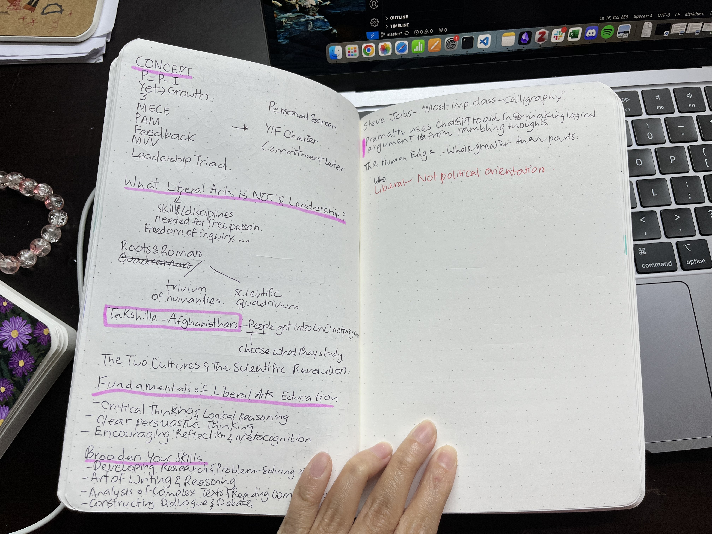

Week 06 of the YIF. I have been meaning to document learnings since Week 01, but I never found the time. Including a new habit into your schedule takes effort.

# Daily Breakdown
## 2024-09-02 (Monday)

### Made my CV
After struggling for many months to perfect my CV, I finally finished creating one. I was asked by a professor to share my CV so he could look for a potential PhD advisor if I'm interested in pursuing one. I used [Superset CV builder](https://joinsuperset.com/). Although it was clunky (with edit widget being too small and it taking forever to load), it helped me format my CV and restrict it to a page. I don't know if I've done a good job at describing my work experience. We were asked to use the PAR Framework (Problem-Action-Result), but I got to lazy and copy-pasted details from my older resumes and modified a bit for consistency.

### Classes
In our Leadership class, we went over what Mission, Vision, Strategy and Values were. It seemed like the professor had gotten Mission and Vision swapped when he explained. In the later half of the class, we discussed what liberal arts education really meant.

_Notes I took while reading Surely You're Joking book on the side_

I didn't pay much attention to the history class. We were critically examining Rasosundari Devi's autobiography, My Life. We discussed what we can and cannot conclude from it about the lives of women of the time, what an authetic piece of historical document is, what questions to ask before making inferences from such texts, etc.

## 2024-09-03 (Tuesday)
### SD Project
At the YIF, we work on a project as part of Experiential Learning Module (ELM). As a Fellow, you are expected to work on either an external or self-designed project for 10 months to gain real-world experience. Our team pitched a climate change game last week and Tuesday, we got to know that we had been waitlisted. It was a bit frustrating that they repeated the exact same feedback for which we had responded during the interview.

We frantically contacted mentors for the climate game as that was one of the requirements. Karan, the director of the YIF, helped as well. He got us to talk to Prof. Vijayraghavan (whom I had always wanted to talk to when I was at NCBS), and the Professor has agreed to mentor us. It was a quick but useful conversation. Later, we brainstormed to come up with a mock-up interface.

## 2024-09-04 (Wednesday)
Last history lecture. Professor's story about M.K. Gandhi had me teary-eyed. I rushed to the library to get the last copy of Kamaladevi's s biography before heading to the ELM team-building session. We had fun activities -- answering trick questions and building a cardboard bridge. We then reflected on how we worked as a team.

Later that day, we met Meghna Agarwala, a professor of Environmental Studies, to discuss the game. It was intense, but some questions she asked like what's the message you'd subtlely want to give through the game, who is your audience, etc. really made us think.

## 2024-09-05 (Thursday)
First, I had an optional DS. I attended it since I thought I had time. Made a cute vision board for myself.

_Where I would like to be in 5 years. Zoom in to read_

## 2024-09-06 (Friday)
We had a half a day's session on design thinking. It was fun. I spent the rest of my day working on the individual statistics assignment.

Check out my statistics assignment, [here]().

AND we got to know that our ELM project had been accepted!

## 2024-09-07 (Saturday)
I had ELM sessions in the morning, which were semi-useful. We were taught how to define our problem statements. We were also given a rough timeline for the term. For the rest of the day, I was immersed in reading Kamaladevi's biography. I'm geninunely in awe with her. I drafted part of the assignment, and called it a day. 

## 2024-09-08 (Sunday)
Final assignment submission for term 01. Woke to fire alarm ringing at 0650. Turn out the alarm had malfunctioned. I was going to wake up at 0700 to do finish my assignment anyway, so I didn't lose sleep unintendedly. I started off by adding context to the quotes I had picked from Nico Slate's biography on Kamaladevi. Half way through, I had to stop writing in between to learn how to cite with page numbers. A useful skill. The essay really came together in the last half an hour. I'm happy I managed to make all the arguments although not in the grandier fashion I had imagined in my brain.

Relaxed for the rest of the day.

Check out my history assignment [here](/posts/term-01-stats-ind-assignment/)
# Week in Summary
Phew, had a lot of ups and downs this week. I'm proud of how my assignments turned out. I'm super pumped that our SD got accepted and that I'll get to interact with Prof. Vijayraghavan more.

# Readings

### [Paper] Many Analysts, One Data Set: Making Transparent How Variations in Analytic Choices Affect Results
A well-written paper on crowdsourcing analysis of data. Same data, same research questions and multiple teams. What the researchers who crowdsourced found was that even when everyone uses the same data and make well-meaning defensible decisions on the statistical approach to tackle the question, there is a significant variation in the answers they get.

### [Book] Surely You're Joking, Mr. Feynman
Light read so far. Feynman is incredibly smart and he doesn't hesitate one bit to show it off. I also didn't know Feynman did biology for a year.

### [Book] Kamaladevi Chattopadhya: The Art of Freedom
I had liked Kamaladevi during Prof. Mukherjee's lectures, but I have newly found appreciation for her after reading parts of Nico Slate's biography of her. I wish I was better at articulating, but I love how badass she is. The book opens with this scene of her building city, which comes to be called Faridabad, for migrants right after independence. She goes abroad when she was 18. She does drama, theatre, activism, travel, writing, crafts, everything. She rebels, breaks norms. She boldy imagines new India, where there is no caste, class and gender inequality, where everyone is able to experience the beauty of art.