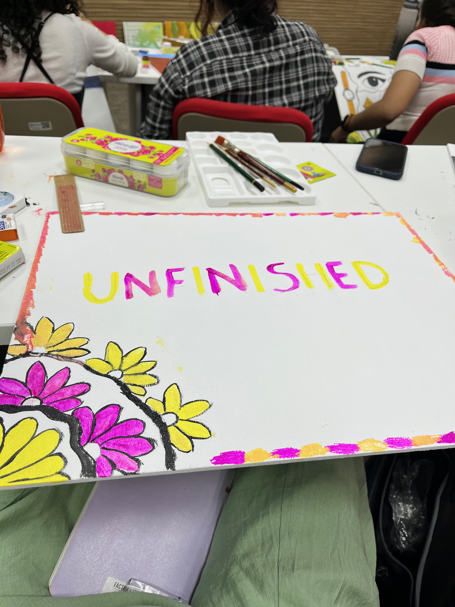
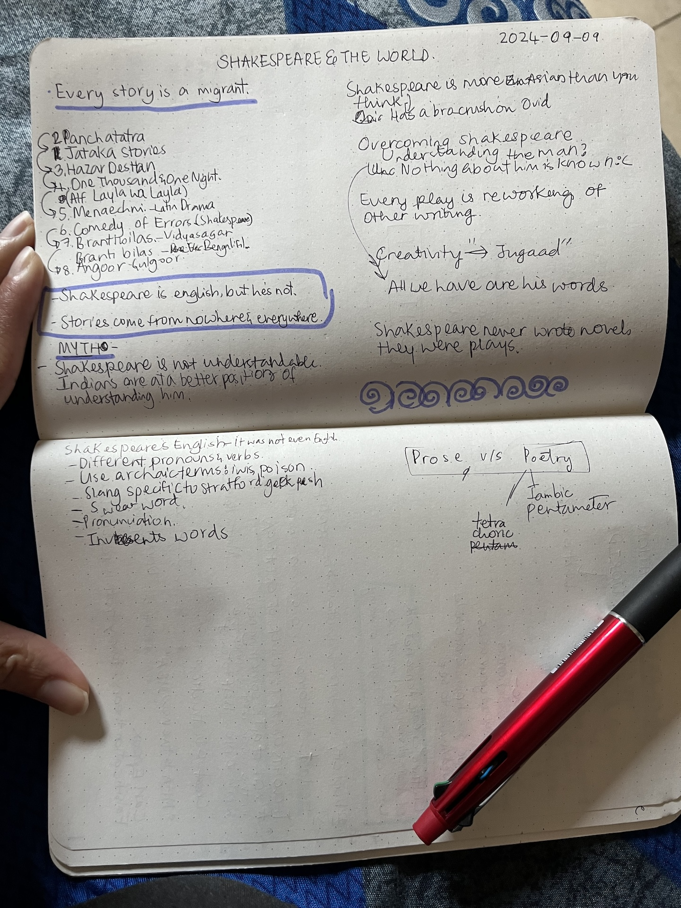
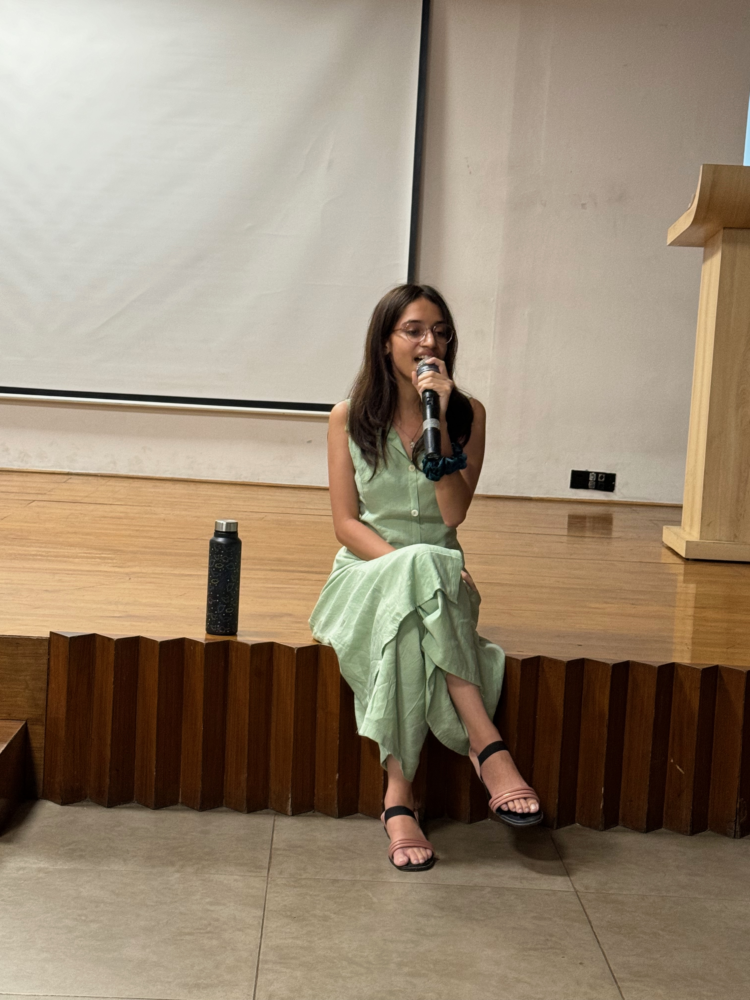

Time is flying! New term from this week. We have two interesting courses, Art Appreciation (by Prof. Anunaya Chaubey) and Shakespeare and the World (Prof. Jonathan Gil Harris and Prof. Madhavi Menon).

# Daily Breakdown
## 2024-09-09
I had an uncomfortable experience during the first Art Appreciation class. Prof. asked to paint a canvas in an hour, give it a title, make note of challenges and display. I made an embarassingly bad painting. I was almost in tears after looking around and seeing amazing art works. I felt even worse because of how I reacted. I wish I was slightly better at dealing with being sucky at something.

_If you are interested to check out my paitning_

On the other hand, the Shakespeare lecture was fun. It felt like I was watching a Netflix comedy show. The Prof. is very engaging and theatrical. We spent the first hour discussing the relevance of the course by debunking myth that Shakespeare is English and elite. One common obstacle we face with Shakespeare is his language. We looked at why that's the case, and how one can overcome it.

_Lecture notes #01_

And, later in the evening, we had an open mic! I finally, after waiting for more than a year, got to perform :) I did a cover version of Love Me Like You Do, by Ellie Goulding. I was very nervous in the beginning, but I felt it leaving me towards the end of my first performance (thanks to the amazing YIF crowd). I had this familiar urge of wanting to perform again. Luckily, a batchmate of mine, had got a guitar and we ended up performing impromptu. A fun night performing and watching other people perfrom as well :)

_First peformance at the YIF_

## 2024-09-10

I woke up tired and hungry. But no choice. Had to get ready because for the 0930 Art Appreciation lecture. In the lecture, we discussed what art is, how we make sense of visual world, and so on. We also explored topics like scopic regime, gestalt. Towards the end of the lecture, we looked at some art work to understand what beauty and aesthetics really mean. In the evening, we had a Discussion Session, where we made sense of each others' paintings. It was interesting how none of the people in my group thought it was a 'bad' painting.

Spent the rest of the day on the ISF proposal.

## 2024-09-11
Again, woke up tired and hungry. No choice. Art Appreciation lecture. We looked at does one make sense of art. Based on discussions from past two days, we arrived at: "Artwork embodies an Intention, which is experienced by Beholder, who uses sensations, knowledge and emotion to generate an artistic experience."We looked at some case studies: Wind of Sea, Madhubani paintings and Yayomi Kasama's work. 

Shakespeare and the World lecture was super exciting. We discussed Ovid's (Shakespeare's "bro crush") _Metamorphoses_. First, I was blown away by the insights the class had about the literary work. Professor complimented them to make the conversation complete. I enjoyed it. I'm now intrigued by the concept of _Metamorphoses_ -- the chaos, the partition of inseparables by gods and humans, the order, the chaos which follows again, the cycle continues.

_Class Notes_
## 2024-09-12
Art Appreciation class as usual. We discussed Unifying Classical and Romantic, the reasoning and imagination. In the Critical Writing class, we explored the concept of literacy and distinguished it from literacy rate. We looked at literacy as something which is specific, plural and contextual. Finally, we had our first stage reading of Shakespeare's drama. We finished 3 scenes from The Midsummer Night's Dream.

## 2024-09-13
First ELM day. Went well. We did some logistical work, brainstormed a bit, called it a day.

I attended the session on how to approach Masters application. It was one of the most useful sessions on higher studies I've ever attended. 

I ended up going to a movie called "Us". It was my first-ever horror movie. Scenes were disturbing. The movie has a really good political message though.

## 2024-09-14
Couldn't sleep well. Woke up feeling tired. Feverish towards the afternoon. Chills at night

## 2024-09-15
Couldn't sleep well. Fever, chills, wisdom tooth ache. Went to the dentist instead of going with the cohort to National Gallery of Modern Art (NGMA). Had an interesting conversation with a YIF alum who happened to come along with me in the ambulance to the dentist. Fell even sicker towards the end of the day.

But everything was slightly more managable because my friend, Arushi, returned to campus after 2 weeeks.

# Readings 

## [Book] Blood and Beauty

## [Book] Metamorphoses, Ovid

## [Book] Exploring The Everyday