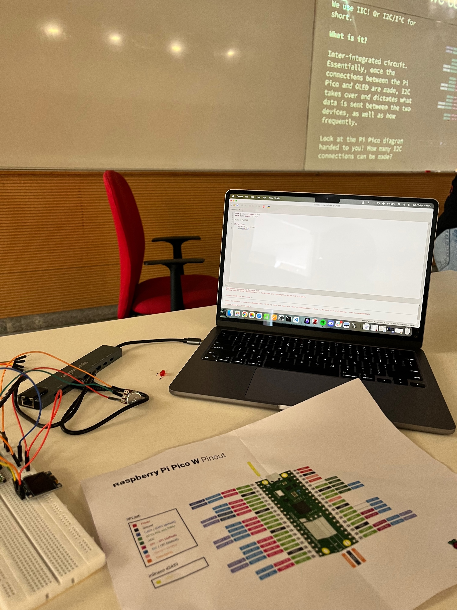
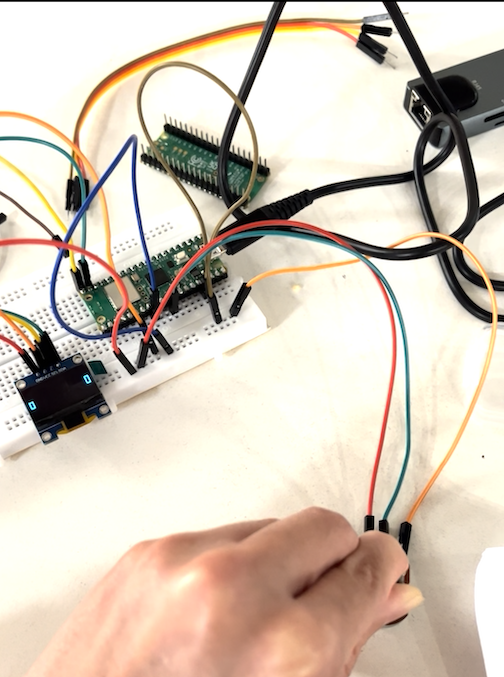

## 2024-09-16
Monday began with breakfast in bed and trip to the infirmary. I was told that I might have caught a stomach bug. Slept all day except to eat and shit multiple times.

## 2024-09-17
Repeat of Monday. Spent a lot of time talking to Karthik and scrolling on phone.

## 2024-09-18
Slept all day again. Felt slightly better. It was interesting how my life was just about surviving one day at a time. I also discovered that social media has changed a lot since I last checked in. I stumbled across a lot of regional 'content creators'. Gone are the days where there was little Indian representation online.

## 2024-09-19
Finally went to a class! Art Appreciation. We discussed MC Escher and Penrose's tessellations which I found to be fascinating. I remembered Peter talking about Escher's work. Got a book from the library called The Joy of Science (has been a joyful read). Read the book, spoke to Peter and called it a day. It was good to be back to being almost normal.

## 2024-09-20
ELM Day 03. Had a refreshing start to the day: read The Joy of Science and wrote to my old mentor Gitanjali Yadav. I have also started to think about my career and thoughts ruminate in the back of my mind.

Later in the afternoon, the ELM Team, Pralay, met to discuss the insights from our secondary research and prepared for the bi-weekly office hour.

I went to a Rasberry Pi workshop in the evening hosted by a society at the University. I felt bit out of place amidst the undergrads in the beginning, but I settled in as we went on. We worked with Pico W. We were introduced to various pins on the board and what they do. There was something satisfying in writing a line of code and visually see the LED glowing.

_In-frame: Pinout sheet, bread board, the OLED screen and code on my laptop to turn on the screen_

## 2024-09-21
We had the office hour with ELM faculty, which went well. The team later met to discuss the aesthetics of the game.

I went to the second half of the Rasberry Pi workshop. We tried recreating the Pong game, but only got till getting to move the paddle up and down.

_In-frame: Potentiometer connected to Pico Pi. Paddle on the OLED screen moving up and down based on the Potentiometer's resistance. (Screenshot from a video taken)_

Evening, I read the book and slept early.

# Readings
## [Book] The Joy of Science
A fantastic book on how and why to adapt scientific method in our daily lives. It encapsulates the thoughts I had when we started IndiaAsksWhy or when I wrote my Self-Designed Project pitch, except that the author is 100 times better at making his arguments.