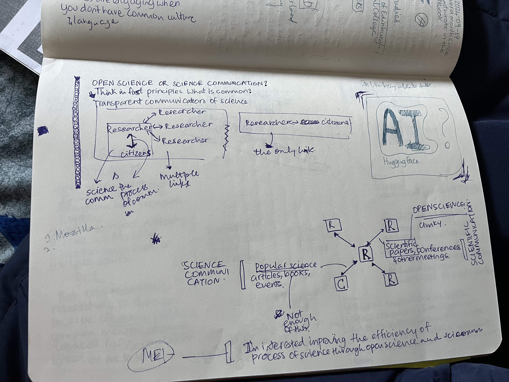
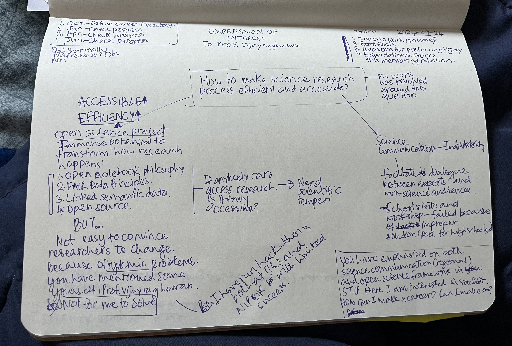

Since I'm writing the account a week later, it'll be brief.

We had the last set of Art Appreciation classes. We looked at different art movements -- renaissance to performance art. I performed My Heart Will Go On in the farewell class. I got nervous, yet again. Being around talented people all the time can do that for you.

I spent the first half of the week writing the Expression of Interest to have Prof. Vijayraghavan as my mentor at the YIF. I have been an advocate for open science since I learnt about it. But in writing to Prof. Vijayraghavan, I collated by scattered thoughts about open science in India to coherent narrative. I collasced my interests in science communication and open science. Prathima Muniyappa, an alum of the YIF, had told me about thinking in first principles. I finally noticed commonality two separate career trajectories of mine.

_Me figuring out the commonality between Open Science and Science Communication_

Later in the week, we had an Alum-in-Residence session. Worrin Muivah, the Alum this time, was such a fun person! He runs something called the STEP Academy in North East India. He said what he took away from the YIF was importance of building genuine relationships with people.

What else happened? AC broke down. I slept at around 0200 one day. That was fun, haha. I attended Startup Ashoka to get a feel for the start-up culture and also talk to people about our ELM. Needless to say, I didn't like it that much. I'm just averse to words like venture capital, business model, etc. But I got a nice hoodie, so I'm not complaining.

During the weekend, I took interviews as a part of ELM. I've learnt so much more about games and sustainability initatives that exists already. Talking to as many people early on in the project helps in addressing some obvious but overlooked loopholes in the solution in the initial phase. However, it also confuses you because of conflicting opinions you hear.

AND, most importantly, I went out to Delhi for the first time. This something I wrote on the Metro:

---
Baby's Day Out, Delhi Edition. 

For the first time in two months, I managed to get out of Ashoka. Every time I tried to make plans, I had to abandon them because of deadlines or health. Finally, the stars aligned today.

I met a friend of mine, Arjun, for the first time at Hauz Khas. I had my YIF friends to guide me to the metro station, it wasn't hard. I got a bit nervous when I had to wait almost an hour at Hauz Khas metro for my friend to turn up. We went to Naivedyam for lunch. Decent Uttampam and great Chutney. Post lunch, We roamed around Hauz Khas village. We checked out a vintage poster shop, Chumbak, Minisou, and an art gallery. Awkwardness lingered for a while, but we got along well. We learnt more about each other. Spoke a bit about YIF and his work.

The experience of going out (minus the meeting part) was disorienting. Everything around me -- the stores, the roads, the people, the train, the station -- seemed familiar. Yet I felt paralysed. I felt like I did not know how to interact with my surroundings. Adding to the feeling was that I was not hearing South Indian languages anymore. Made me feel even more out of place, scared almost. It was like I was re-learning how to be human.