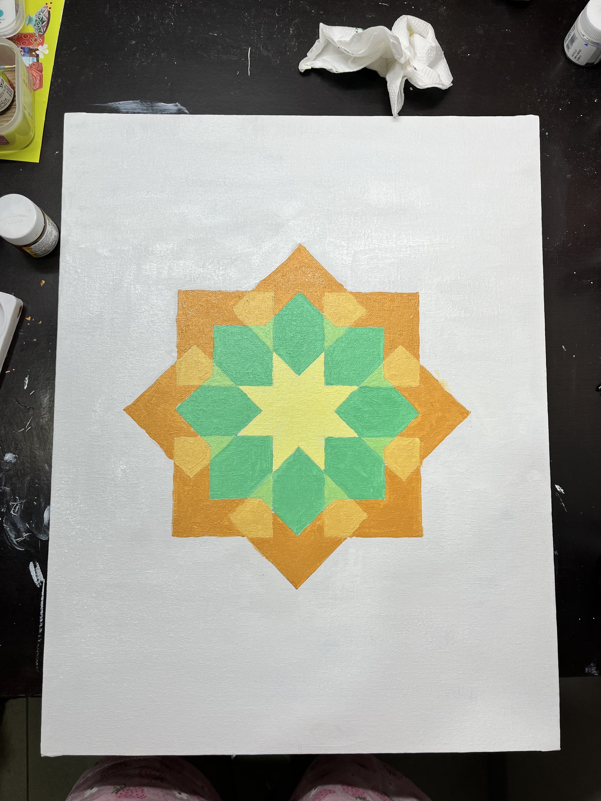

## 2024-09-30
Thanks to the stage reading sessions, I fully read _The Tragedy of Romeo and Juliet_. Later in the evening, we had the first lecture where we discussed the play. I finally get how literature classroom discussions work. Prof. Menon only posed questions and kept probing for answers from us. We collectively make sense of the concepts by contributing our understandings. It's very rare for a STEM class to be democratic like that. 

I finally met my program anchor, Sudheer. He tells me that things will fall into place and that I shouldn't worry. I cannot seem to gather enough optimism to believe that. I have been thinking about applying to the Commonwealth Scholarship. I feel like I won't have enough time. Is it worth adding another stress to the existing masala of stresses? I don't even know what to do differently from my previous applications. Maybe I should talk to more people and ask help.

I slept late again. This time I was speaking to Karthik and got carried away.

## 2024-10-01
Morning off after a long time. I spent the morning on the Art Appreciation group project abstract and later figuring out deadlines.

Back to back classes in the evening. I had fun learning about ethnography. We did a quick observation activity. I went to the library with my team and made notes about the environment and people. Shakespeare class was a little dissapointing. All we spoke about was death and desire and I got bored. My roommate and I  had a karaoke night later. A nice distraction. Wish I sang more often.

## 2024-10-02
Finally got the time to write updates on this blog and think about what to make for my final presentation. I had a tough conversation with Karthik; brain is a bit messed up.

_The log is being written on 2024-10-20 i.e., 18 days later_

Later that day, I attended an origami workshop and had my first jam session at Ashoka. We sang Hindustani and Carnatic. I had fun. 

## Later that week
We read Layla and Majnun and followed it up with a classroom discussion. I remember feeling empathetic towards Majnun, the mad man. It was a really good introduction to Sufi literature. 

As a part of YIF Mentorship Programme, I wrote an Expression of Interest to have Prof. Vijayraghavan as my mentor. He agreed. I'm excited.

Friday and Saturday, we did some world-building for climate game. We played a game called Civilisation for inspiration.

Saturday, I submitted the application to Science Journalism Association of India's conference happening in Dec. 2024.

On Sunday, I had made my final canvas for my Art Appreciation course. I adapted an Islamic geometric pattern. It was therapeutic to draw circles and lines, and paint the shapes. I almost forgot about the misting while painting and had to run out with incomplete painting. Later, we conducted a comic making hour; we had finalised to work on comics for Art Appreciation group assignment. 

