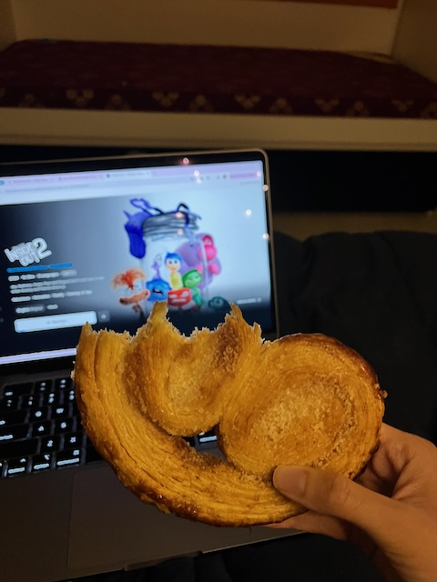

---
author: ["Shweata N. Hegde"]
title: "Week 11| The Young India Fellowship"
date: "2024-10-20"
description: ""
tags: ["life", "term-02"]
ShowToc: true
---
Days: 2024-10-07 to 2024-10-20

Final two weeks of Term 02, Week 11 and 12, were filled with deadlines. As a result, I was stressed, confused, tired, agititated (fought with Karthik quite a lot). I feel like or even have the time to journal as you can tell. But we have made it through. Here's my attempt at recounting key events from the two weeks.

At glance, here was my deadline list. Art Appreciation and Shakespeare combined, I had 5 assignments, a conference presentation (The Tech We Want), meeting with Prof. Vijayraghavan, a scholarship application (I discontinued working on it).

_My deadline list_

## All of what I did

## Week 11
### 2024-10-07
On Monday, we watched Ram-Leela, an adaptation of Romeo-Juliet. For a movie with shooting, Bolywood drama, and so on, I wasn't excepting to be in tears when Ram and Leela die. I gained more depth through the discussion in class, including the politics surrounding the movie and its name, the reason for extravagant set, the references to Romeo-Juliet, and so on. (Wish I had the time to summarise here).

### 2024-10-08
We watched another adaptation of Romeo-Juliet, Arshinagar. It was a low-budget movie, with some very funny fight scences. I did not like it. After having a professor who knew everything about comics, I spent the rest of the evening working on the Art Appreciation group assignment. I was a bit disappointed by the team not synergising. All used Generative AI models for creating their content, I felt very lonely in the pursuit of actually trying to understand comics.

### 2024-10-09
**The Presentation Day**
Although not sufficient, I had curated enough material about comics to feel confident. It was important I felt prepared; it was first ever presentation to the cohort. The presentation went okay. The professor enjoyed. I sat through couple of presentations; they were interesting. Many were performed-based -- entropy through music, roleplay, and so on.

Later, we had the Art Exhibition, so many amazing paintings. Our cohort is so talented.

### 2024-10-10
We discussed Arshinagar, the movie, in our final Shakespeare class. I spent all my free time working on the Commonwealth Application. I eventually realised I did not have genuine answers to some of the questions. I felt incomptent to even describe why lack science communication is relevant in the present times. I gave up on applying. It was a tough decision, but in retrospect the right decision, because I wouldn't have had the time.

### 2024-10-11
I spoke to Vijayraghavan. It was not glorious as I thought it would be. Here was the reflection I wrote:

Prof. Vijayraghavan and I set up the agenda for the mentorship sessions: figuring out what my next steps would be to continue working on science communication and open science. Prof. advised me to list science communicators, track their career trajectories, and analyse whether I can emulate their career steps. Similarly, he also suggested researching communication organisations (in general), ThinkTanks, and international grants, that might be interested in science communication. His idea is that I can join the communications team and pursue science communication.

For continuing work on open science, Prof. asked me what I wanted to do. Are there organisations I can work for? I discussed that organisations like Wikimedia Foundation, Mozilla, etc. have openings. But they require the employee to also take up managerial or technical work. Prof. suggested I showcase those skills to get the job. I have to be a science communicator and a manager.

He said that higher education is an option only if you are rich enough to study abroad. Yes, the degree holds an intrinsic value but its objective is also to extort money.

All in all, the call was a reality check. Prof. said that I couldn't be chasing exciting ideas and interests. The world will not support me or my interests. I will have to find a way to get someone to sign a cheque. Therefore, I should be thinking about how to fit into organisations, and have a longer-term vision rather than just pursuing interests.

Over the week, in the Critical Writing classes, we studied Ethnographical practices. We are also assigned a group research project. Our group is studying how YIFs take decisions about spending their time.

### 2024-10-12 to 2024-10-14
I spent these three days completely on the final Shakespeare assignment. Our team chose to reimagine Romeo and Juliet for art and science. We personified beaker and brush and through their conversations unravelled the interconnections between arts and sciences. In the short time we had, Arushi made drawings for every scene and we produced a stop-motion animation. For reasons, there was no synergy in the group and the experience wasn not enjoyable. 

On 14th, I had office hour with a Creative Writiing faculty. She gave useful feedback on my previous scholarship application. There is so much to improve upon for me. I'm so glad I chose not to submit the Commonwealth Application, it would have been sub-par.

Oh, and one of the days, I got to know I was selected to attend SJAI conference :)

## Week 12
### 2024-10-15
**Shakespeare Festival**
I was blown away by the amazing reimaginations the cohort had produced. From musical, Qawali, poetry, comedy, to queer love, cross-religion marriage, and so much more! However, I did not feel fulfilled with our reimagination. The idea did not materialise the way I would have wanted it to.

I had no time to relax. I came back and work on the The Tech We Want Summit slides and Art Appreciation final paper.

### 2024-10-16
For the paper, not surprisingly, I chose to write about the power of scientific illustrations. I wrote case studies of Jane Richardson's Ribbon Diagrams, David Goodsell's cell landscapes, and Nirupa Rao's tree illustrations. It was fun.

### 2024-10-17
From waking up, I worked on making the slides for my presentation at The Tech We Want Summit. I was on the sustainability panel and had to be creative in talking about #semanticClimate from that lens. Peter explained how unsustainable PDFs are as they locks up the knowledge. #semanticClimate, by turning the document semantic, is helping reducing the opportunity cost aned making the knowledge usable. In particular, Peter re-discovered the concept of 5-starification of data and suggested we call our software chain as engine 5-starifying documents. I put together the slides in couple of hours and presented at the conference later that day.

<iframe width="560" height="315" src="https://www.youtube.com/embed/o50Jd1w6xKw?si=x0sYMlQJyJSKim7R&amp;start=16818" title="YouTube video player" frameborder="0" allow="accelerometer; autoplay; clipboard-write; encrypted-media; gyroscope; picture-in-picture; web-share" referrerpolicy="strict-origin-when-cross-origin" allowfullscreen></iframe>

The presentation went well. The Summit was well-curated and I listened to all the panels -- the poltiics of open tools, maintainence, and so on.

### 2024-10-18
Started with office hours with our ELM supervisor, then spent the morning on our ELM. Later. I went to a higher studies career fair in the afternoon. They weren't useful, but I was mainly there to collect brouchers I'll never read.

I attended Demo sessions of The Tech We Want, the tools were all super cool.

### 2024-10-19
**Anniv day**
Spent the morning and afternoon on the ELM. Later in the evening, we went around sticking posters to get people's attention to fill our climate survey.

Karthik and I watched "Inside Out 2". I'm super glad we spent quality time together. Arushi had gone out and got me a Palmier to eat. The movie wrecked me, but I felt so much at peace after spending time relaxing with Karthik.

Later in the evening, I spoke to Adrian. I gave him updates about what had happened in the past two weeks (not too different from what I've written here), we discussed comics, nobel prize, views on AI, and much more. Slept late.

### 2024-10-20
Worked till afternoon. Felt like our ELM team had hit a slump. Finally got to journalling. Spoke to Chandrani in the evening. In giving her a gist of the past 3 months, I realised the breadth and depth of work I've done so far at the YIF. After cutting the call, I went to meet Arushi and Shamant to discuss music. Post dinner, I met Pravin who told me everything about PowerBi and the big data work he does in the social sector related to schooling. He really has inspired me to work on meaninful data problems. 

## Reading List
- [Book] Understanding Comics, Scott McCloud
- [Book] Sequentual Art, Will Einser