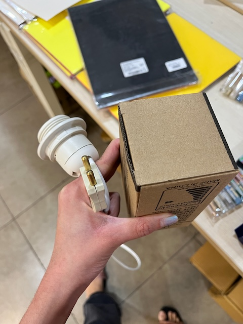
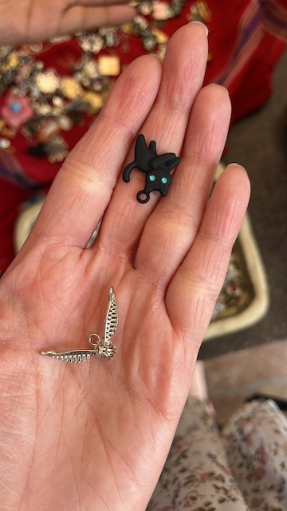
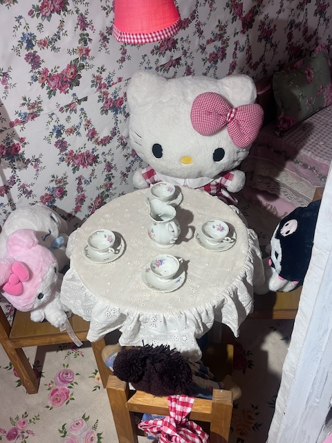
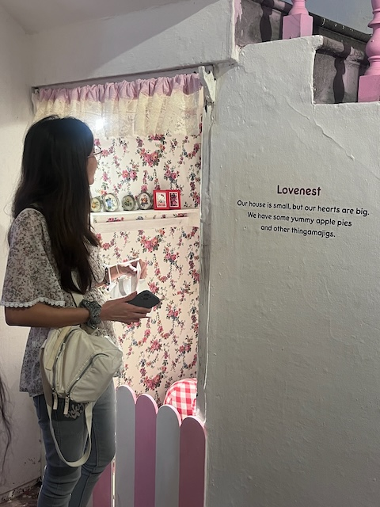
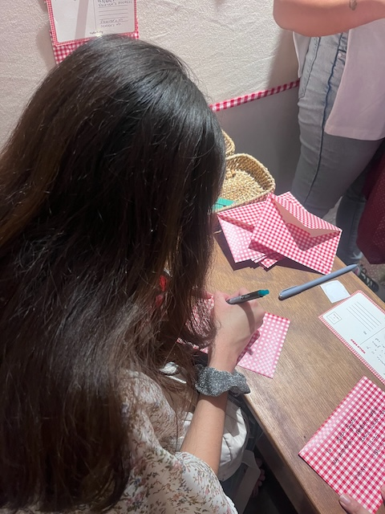

## 2024-10-21
Woke up early today. Journalled, showered, worked on the Critical Wriitng researched project and journalled even more. The website has finally caught up to the present day. Having been deep into Climate Game work, our ELM team took a break from work, so I spent my time on Chevening application. Drafting these essays is hard. Sometimes you feel great looking at your past work summarised, and at other times you feel stuck, doubting yourself. 

## 2024-10-22
Typical work day. Our ELM team worked remotely? Oh, yes. we did. We discussed the mechanics of the world in detail. One of our team members was leaving home. I spoke to Karan during our meeting and he told me I will not be able to attend SJAI's Science Journalism Conference in full.

Later in the evening, I went to the lamp making event hosted by the Makerspace. I had a fun time cutting wire, stripping, soldering and connecting the plug. We couldn't get to making the lamp cover though :(. 

_The wire socket I made. The bulb in the box._

## 2024-10-23
It finally felt like we made progress. We had a Naamkaran ceronomy for the factions in the game and charted out the game scenarios arc. More details on the Notes page: [https://pralay.netlify.app/notes/2024-10-23/](https://pralay.netlify.app/notes/2024-10-23/).

## 2024-10-24
After every productive day, it feels like we need time off. We took the day to come up with game scenarios. I continued working on my Chevening application. I had super helpful Office Hours with Soumya from Centre for Writing and Communication on the application.

I also got myself two charms :)

_Snitch and black cat_

## 2024-10-25
We discussed our scenarios. I finally felt like all the basework we had done to build the world was all coming together through scenarios. Check out the scenarios here: [https://pralay.netlify.app/notes/2024-10-25/](https://pralay.netlify.app/notes/2024-10-25/).

We were suppposed to go to a student concert, but could not get tickets. Arushi and I ended up watching Matilda together. It's a fun light-hearted movie :)

## 2024-10-26
The day started with Office Hours for the Climate Game. We then brainstormed the board game version of it for the upcoming interview with the India Science Festival. 

Post lunch, Arushi and I left for Delhi. It took a lot of internal convincing for me to say yes to going out. We visited the Hello Kitty exhibit and roamed around Connaught Place. I got myself a jacket and I love it! Hanging out with Arushi was fun. I finally know how it feels like to go out with your best friend :)

_Cute Hello Kity Dining Set under the staircase_

_Me peeping to see the Dining Set_

_Me writing a letter_

We were exhausted by the time we came back. I showered, ate dinner and slept after arguing with Karthik.
## 2024-10-27
I woke up late. Got out of my room to attend this super cool sound engineering workshop. I washed my hair and tried working on the Chevening application. I got sidetracked by the STEM Quiz. Our team did miserably. I worked on the application and called it a day.