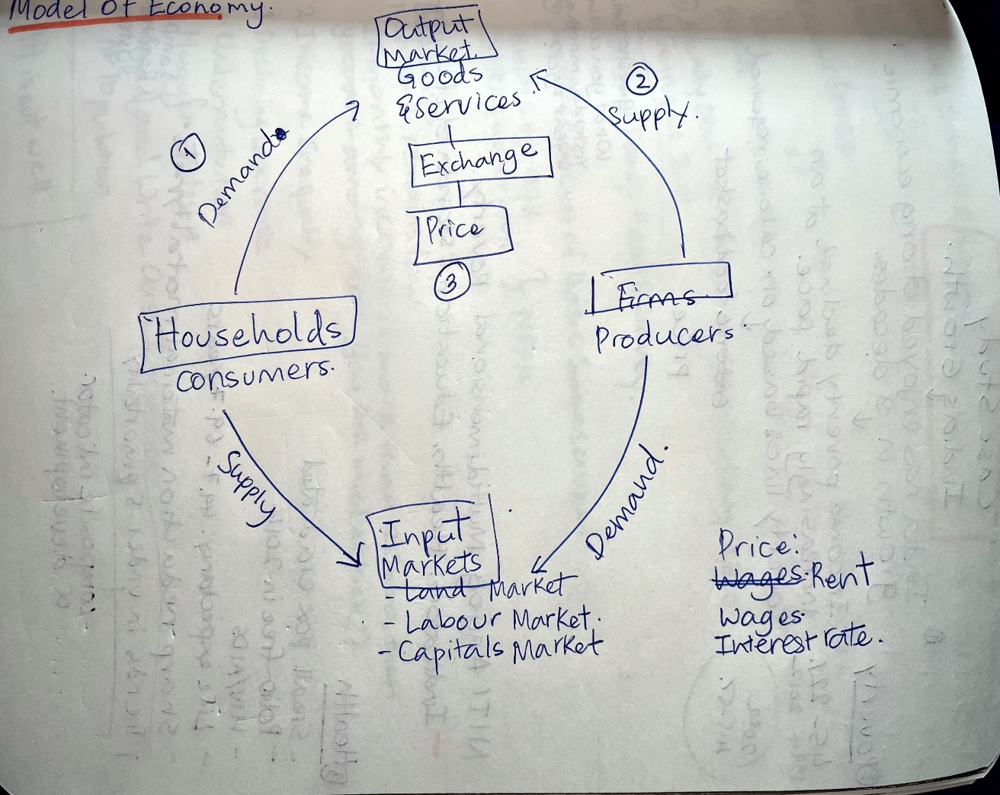
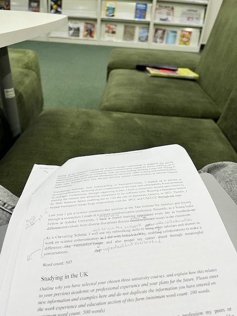
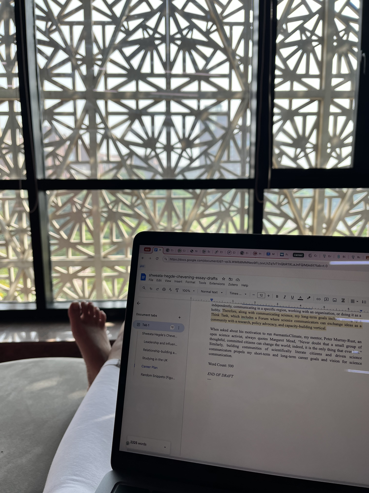

Term 03 officially begins. I am excited for the courses this time. We have Microeconomics and The New Geography in the Information Age (NGIA) -- a funky name but it is a course on information in the age of internet. This week features me singing, reading a lot, working on Chevening Application, spending time with the cohort and having quality time with Karthik. 

## 2024-10-28
First day of Term 03. We had to back-to-back lectures. Woke up early, made it to class 20 minutes before it started. Prof. A. K. Shivkumar from Harvard is teaching us Microeconomics. I like his lecture-approach, simple whiteobard and marker style. We were acquainted with the basics of microeconomics. The problems of the society -- what to produce, how to produce them, how much. We discussed the need for intervention of the market -- supply-side and demand-side. We ended with with model of economy. In the last half an hour of the class, we looked at the case study: India in numbers.

_Model of Economy_

NGIA was interesting, too. We discussed China's social credit system and surveillance. The course is taught by Prof. Debayan Gupta. It is a bit hard to keep up with him as he throws out ideas and readings. But I can see the course being fun.

I had Office Hours with Centre for Writing and Communication (CWC) to discuss my application on which I had made decent progress, before going to the concert by Amit Chaudari hosted for the YIF cohort. Later in the day, I myself perfomed at the Broadway-themed open mic. Singing Let It Go from Frozen reminded of countless times my sister and I have sung this song together. It was special to sing this song to an energetic audience.

I came back, worked on the application and slept late after fixing the argument with Karthik.

## 2024-10-29
Another fun Economics lecture. We discussed the Demand Curve.

In the afternoon, our ELM team was supposed to have an interview with the India Science Festival folks but they did not turn up to the meeting. I had the Critical Writing class next. We disussed "Critical" theories and I lost my lecturer half way through.

I spent the rest of the day on my application.

## 2024-10-30
My nose was blocked, which kept me up for the better half of the night. Woke up late. Missed the first ten minutes of NGIA lecture. But the class discussion was great. Our case study was Amazon. We looked their business model, Bezos's vision when he first started the company, and so on. We moved on to talking about ads, user profiling, cookies and so on.

I had yet another Office Hours with CWC. It has been very useful to think out loud before drafting the essays.

The rest of the day was spent lazing around watching Kara and Nate, writing the essays in bits and pieces, and talking to Karthik.

_Reading my essays_

## 2024-10-31 -- Start of Deepavali Break
The campus felt very empty. In fact, there were only three people on my floor who stayed back on campus for Deepavali. I started my day with the "Study in the UK" essay. It took quite some time to research about the shortlisted courses and write something concise. I took the afternoon off to join the reading session hosted by the leftover cohort on campus. I read a chapter of the book, "Understanding Comics", but spent the majority of the time socialising and listening to stories from people. It was relaxing.

I came back to room, worked on my essays, watched an episode of Phineas and Ferb with Karthik (we had been meaning to watch it for a year now) and called it a day. I could not sleep for some reason. My body felt itchy and breathing became harder. I probably must have fallen asleep at around 0100.

## 2024-11-01
I woke up late as a consequence of the disastrous night. I suspected bed bugs and washed all my clothes and bedding. I read FAST India's SciComm ThinkLab report and STIP. I got introduced to The Very Short Introduction Series by Oxford by one of my peers and spent the afternoon reading the tiny book on Environmental Politics. 

In the evening, we all got together to celebrate Deepavali. I am so glad one of us took the initiative to do something to mark the day. Although not grand, this was the first time in six years that I was celebrating Deepavali. Still away from home. Maybe next year.

I finished drafting all the essays and felt very pleased with myself.

## 2024-10-02
A regular morning. I read my essays again, made minor changes and finalised the version. In the afternoon, I contacted people asking for feedback. I worked on Critical Writing research project summarising one of the interviews.

Abi arrived in the evening, welcomed her to room. The evening was spent on the new Very Short Introduction I borrowed from the library: Big Data. Post dinner, I conversed with a Chevening Scholar who gave feedback on my essays. I was happy that she thought most of my essays were great. Boosts confidence. She had several suggestions, I will working on them over the next two days.

## 2024-10-03
Brings us to today. Spent the morning reading the tiny book on Big Data. Read about the plight of Warehouse workers (a recommended reading for NGIA) and am now at the library. I will work on the application, the essay due for NGIA, and read.

_View From 2nd Floor of HDFC Library_

## Readings

- [Book] Environmental Politics, A Very Short Introduction
- [Book] Big Data, A Very Short Introduction
- [Article] [SciComm ThinkLab Report](https://www.fast-india.org/wp-content/uploads/2024/08/SciComm-Thinklabs_Report.pdf) -- outlines the current status of Indian Science Communication
- [Article] [I Was a Warehouse Wage Slave](https://www.motherjones.com/politics/2012/02/mac-mcclelland-free-online-shipping-warehouses-labor/)