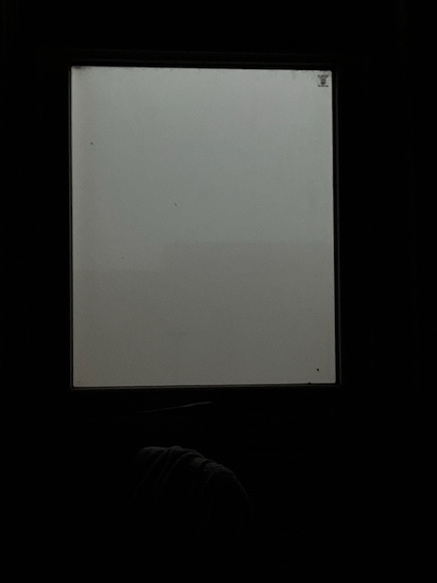
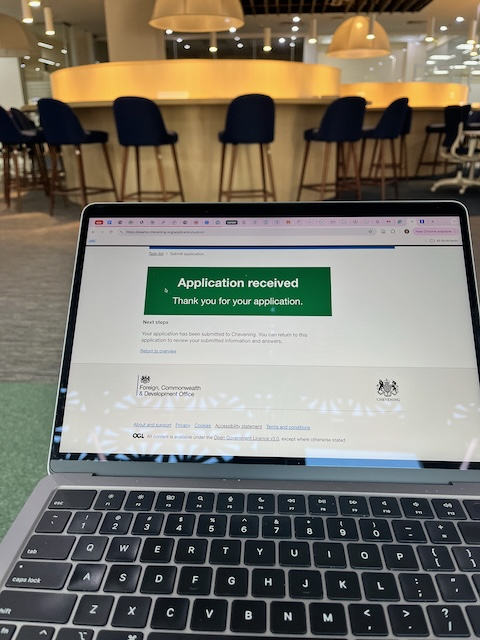
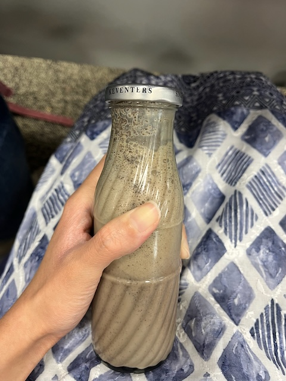
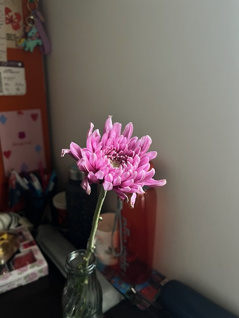
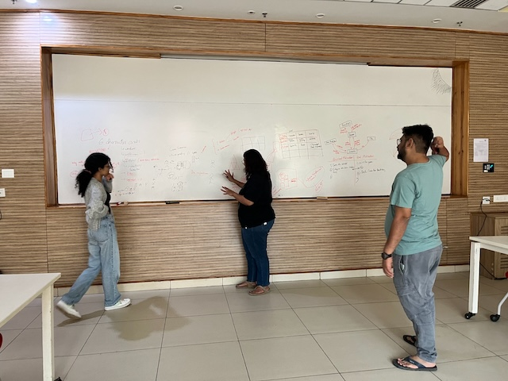

Here is the grammar-corrected version of your excerpt:

---

Yet another break. No matter how much I try to be consistent, the YIF schedule gets in the way. Let me try to recount some important events.

## Smog Takeover
Nobody tells you, but July to October is probably the best time of the year here in Sonipat. Winter is too cold and polluted, and summer is too hot. As November has progressed, Sonipat has become a lot colder, and the air quality has declined significantly. The room smells of burnt stubble (one of the contributors to pollution), as does my hair and mask. Waking up with a blocked nose is now a daily occurrence.

_Smog reducing visibility, as seen from my window_

## Chevening Application Submission
After multiple rounds of reviews and edits, I submitted the application on the last day of the deadline. It is one of the few applications I have been proud of. Hoping for the best.

_Submission done_

## Birthday
Yes, I turned 23. Nothing special. I cried a lot after realizing that, unlike previous years, I had nothing nice to say about 2024. The birthday celebrations were decent. I watched a movie with Arushi, drank Keventers (thanks, Anushka), ate pasta, got quite a few gifts (really grateful to Arushi, Anushka, Pravin, and Adrian), had two mini cake cuttings, and the class sang "Happy Birthday." Hopefully, next year, I will be slightly happier.

_Happy birthday poster on my door (by Arushi)_

_Keventers (by Anushka)_

_Post-birthday gift (by Arushi again)_

## The India Science Festival and Pralay Board Game
When our Self-Designed Experiential Learning Module got approved, we applied for a booth space at the India Science Festival (ISF). In the second week of November, we were interviewed by the organizers. A few days ago, we learned that we had been selected! I am super excited to finally attend the ISF after wanting to do so for 3 years. The team has spent many hours developing the board game version for the booth. Hopefully, it will be ready by the end of December. The event is on the 11th and 12th of January in Pune, again :)

_The team brainstorming the details of the board game_

## Essays and Quizzes
This semester has had less group work and more individual assignments, which I am enjoying. So far, I have written 6 essays for NGIA and completed 2 quizzes for Economics.

The NGIA course is not as fun as I thought it would be. It feels very scattered, making it hard for me to fully absorb everything the professor talks about. However, I have been introduced to blockchain, zero-knowledge proofs, surveillance on the internet, rabbit holes, echo chambers, and so on. Economics, on the other hand, has been insightful. Learning about a new discipline in an organized fashion is the best kind of learning joy I can ever experience. Prof. Shiv Kumar delivers that. Of course, microeconomics has its limitations (just like a physicist's spherical cow), but it is still useful to learn the basic principles being taught.

I did not enjoy doing the Critical Writing Ethnographic study and report. Maybe it was the topic, the timing, or the team—I can't pinpoint it. I'm glad it's over, and we finally managed to submit something satisfactory.

## Other Tidbits
- I have been reading quite a bit: *Palestine* by Joe Sacco, *Big Data* by Dawn E. Holmes, *Philosophy of Science* by Samir Okasha, *Evolution and Tinkering* by François Jacob, *Critical Theory*, many articles for NGIA essays, and the list goes on.
- I attended a 3D printing Makerspace event. It was my first time with the machine. I enjoyed it but was disappointed that I didn't get a chance to make a 3D printed object myself. I also learned about the RepRap Movement.
- At a student-led performance, I heard acoustic violin for the first time since I stopped playing. It made me emotional. Of course, the music and performance were also exquisite.