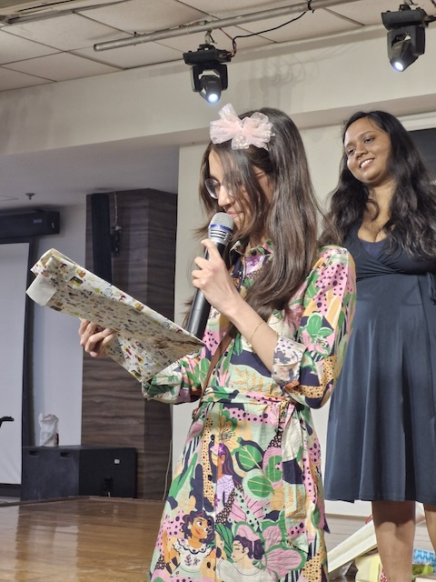

Past 15 days of Organisational Dynamics course has been a mush. I am constantly startled by the fact that it has only been running for the past 15 days. Feels like life has been this 0900 to 1900 grind forever. Simulations, readings, co-education, instructor-led group discussions---argh, I was always surrounded by people. Some days were great, others weren't. However, it was the very same people who made it easier. I grew closer to my cohort and am finally starting to feel like I belong.

In terms of the learnings, the course felt like a speed run of possible scenarios that would play out when you are part of groups. The course has given me the vocabulary and framework to describe and critique functioning of groups. I particularly liked learning about paradoxes in group dynamics and watching groups forming and dying. 

Career-wise, the main highlights were talking to Prof. Vijayraghavan and Prof. Usha Raman about my career. I am a lot more optimistic thanks to their advice and encouragement. Not to jinx, but I might have chance of building a career in science communication afterall.

Amidst all this, I managed to attend Secret Santa evening, my first social event after the open mic. It was fun. I got a poster which was a hybrid of unicorn and hello kitty.

Photo Credit: Samadhan (I think)