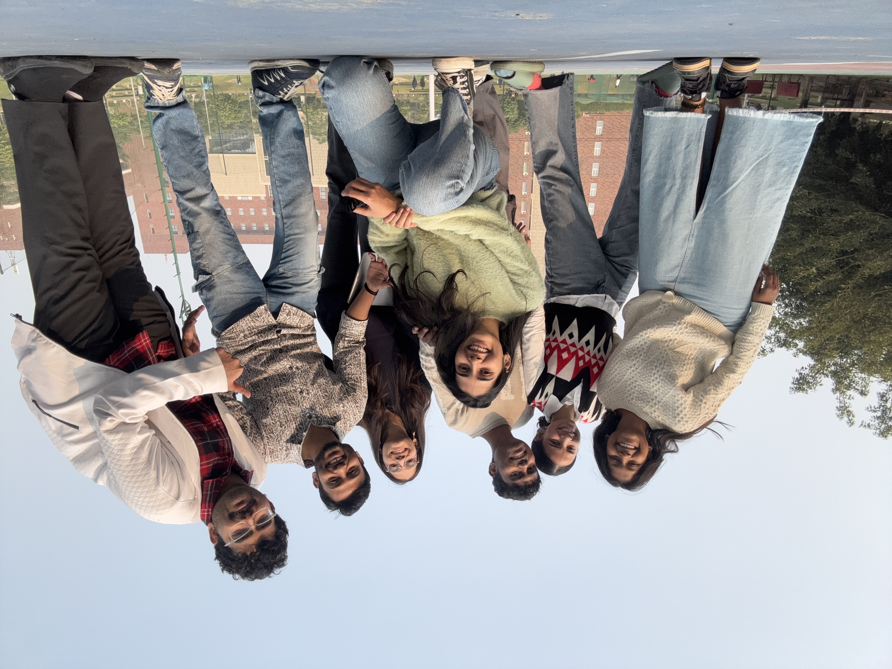
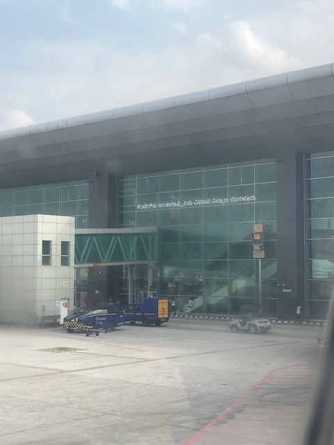
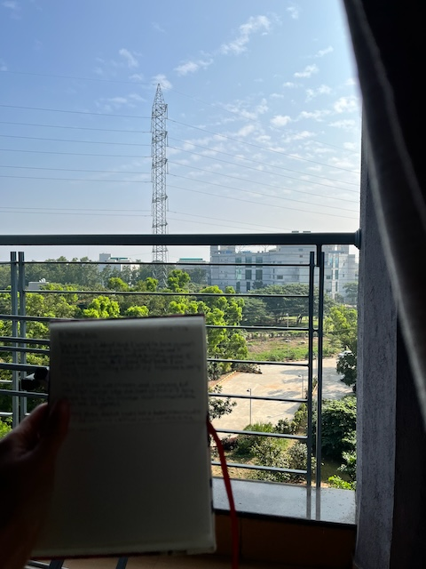
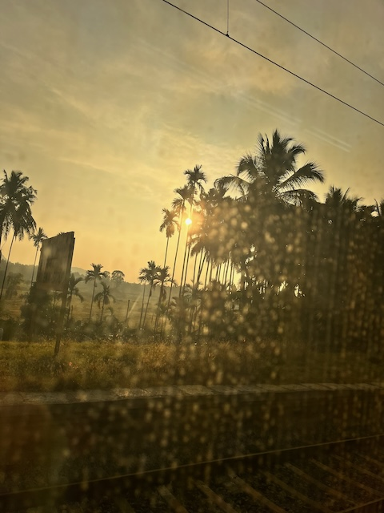
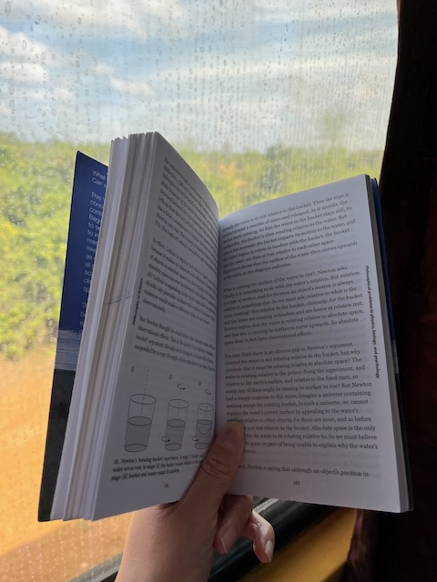
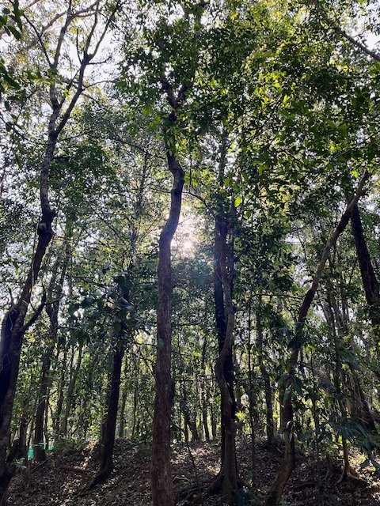
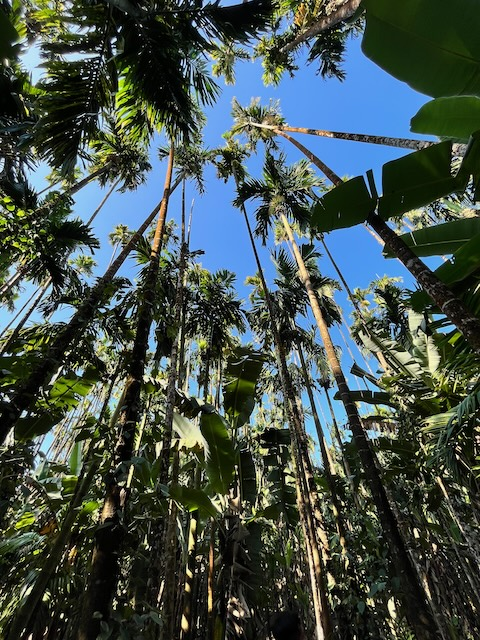
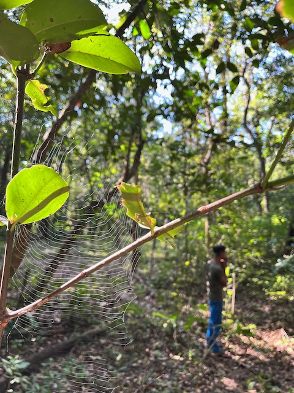
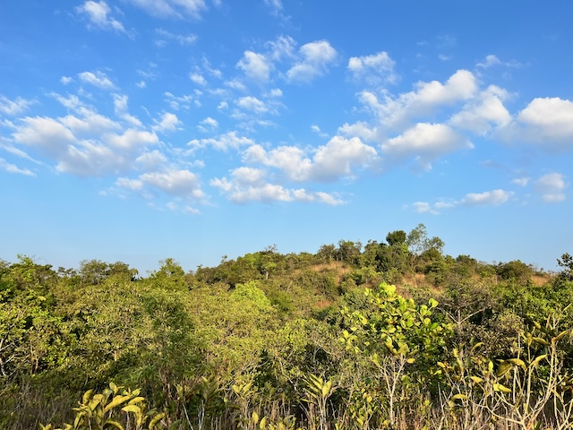
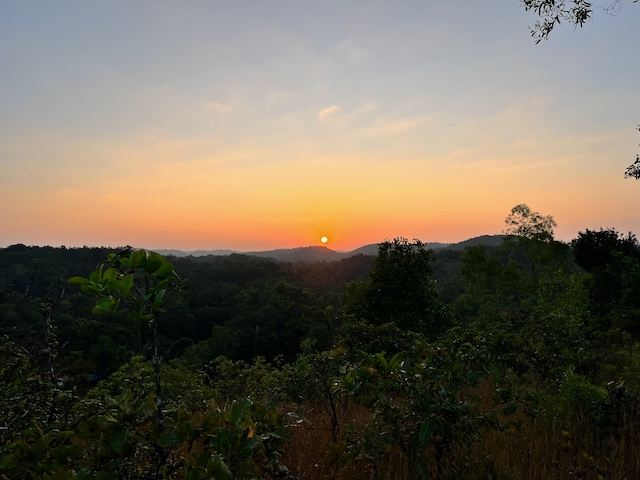

 had one of the most colorful weeks of 2024. December was indeed an interesting curveball I wasn't expecting.

## 2024-12-22
The last day of Organizational Dynamics. It started at 09:30. The lectures were boring, honestly. In the afternoon, we were given the final group assignment to express our learnings from the course through a creative piece. Although I was initially hesitant, I ended up dancing with the group. It was definitely a memorable experience, and I am super grateful to my team.

The day became exhausting as we continued with lectures and the final activity of expressing gratitude to each other. The class became incredibly noisy, which made me leave earlier. I also had to pack to go back home. Packing didn’t take as long. Pravin was around as I packed, so it wasn’t a boring activity either. However, the worst part came when I couldn’t sleep. I had dreamed of going home almost every day since the second month of staying at Ashoka. The day had finally arrived...

# Going back home...
## 2024-12-23
I woke up at 04:30 and got out of bed at 05:15. I was pooling a cab with a fellow Fellow, Jahnavi. My flight was at 11:45. We reached Delhi airport surprisingly early at 07:15. After security, I stopped by Carnatic Cafe for Masale Dose. It was yum. After a quick round of shopping, I napped for a bit before heading to my gate. The flight ride was quiet. I only regretted not getting my neck pillow. But my anticipation of returning home made me restless, and I wouldn’t have slept well anyway.

After landing, I felt overjoyed reading "Bengaluru Airport" written in Kannada. As I stepped out and took my first breath, I couldn’t help but smile under my mask. Distance does make you grow fonder of your homeland.

I was staying in Bangalore for a night, and Adrian had booked a guest room for me at the BLiSc campus. After having a delightful small talk in Kannada with the cab driver, I made it to the inSTEM gate and was greeted by Adrian.

I freshened up and left to meet my TIGS colleagues. Coincidentally, it was one of my colleagues' send-offs. I got to meet everyone at the same time and also send her off. I spent about 15 minutes later looking at the progress on some of the projects I had started. I was happy to see that they were being taken forward. Adrian seemed super busy, so I met Vishal at C-CAMP instead. He was the annoying person he always is, but there was some comfort in seeing his familiar face. He gave me a couple of chocolate bars (which came in handy later when I traveled to my grandparents' place).

Finally, I went over to NCBS. Adrian was talking to his PI, and I went off to wander. I bumped into Chandrani, my ex-roommate. She was taken aback, as expected. We also met baby Shaon on the way. At the canteen, I met Siddharth and Shreekant. Meeting people one after another made me realize that I actually know a lot of these people! Even the canteen staff recognized me :)

Over dinner, we mostly spoke about the YIF, interspersed with other folks describing their work. I retired to my room after dinner and dozed off.

Adrian woke me up. I went over to his Naidile room. It was beautifully curated :) I wish I had photographed it. We spent some time talking, and he played the bass guitar. We also played a game of UNO (I lost, hehe). I came back to my room and slept.

## 2024-12-24
I woke up early the next morning despite being tired. I went over to the medical shop nearby for essentials. All of the previous day, I had used dish soap to wash my hands. I showered, journaled, and left to have breakfast at C-CAMP. It was nostalgic because the only time I had breakfast there was on my joining day. Over breakfast, we spoke about Adrian's experiment.

I went on a quick Archives tour. They had an exhibit on the Green Revolution. I met Siddharth at the Acad canteen next. We had a useful discussion about the current status of science communication in India and a potential abstract for the critical writing conference.

I went back to InSTEM for lunch with Adrian and then left. On my way, I had an argument with Karthik about a comment I had made the previous day. It wasn’t fun. After reaching Mysore, Dad picked me up.

I freshened up after coming home, sang with my mum and sister, and slept.

## 2024-12-25  
Lazy day at home. I tried learning Affinity and writing but essentially did nothing. Scrolled and scrolled and scrolled on my phone.

## 2024-12-26  
I spent the morning working on a movie date poster for Karthik. We watched *How to Train Your Dragon 2* in the afternoon (his choice). I met my ELM team in the evening. Ate dinner, packed, and slept.

# Off to Sirsi  
## 2024-12-27  
I had forgotten to set an alarm and was grateful for having proactive parents who bang on the door to wake their kid up. Left for the station. Nostalgia started hitting as Dad dropped me off and when the train journey started.

I slept for a bit, had breakfast, and started taking pictures. I also did some reading: *The Philosophy of Science* book, Siddharth's paper on scientific temper, and *The Art of Statistics* book. I also tried to do some writing, but was unable to.

After entering the Western Ghats, the views became more scenic, and all I did was look out. I also really needed to pee, but the washroom smelled awful. My kaaka was late by 45 minutes in picking me up, which made me slightly annoyed. We ate at a local restaurant (my anxiety went through the roof). We went to the market for some shopping before heading to Kadnamane, my paternal grandparents' place.

I greeted all my family members, freshened up, spent time learning more about my youngest cousin (who is now 2 years old). I was pleasantly surprised by how well the internet worked there. I could speak to anybody!

Arushi got really curious about life in villages and bombarded me with so many questions. She was also fascinated by our home. I sent her picture after picture. We even agreed to co-own a place designed by her.

Before going to sleep, I gazed out and saw so many stars! It was blissful :)

Slept well.

## 2024-12-28  
The only full day at Kadnamane. I had Tellevu for breakfast immediately after waking up. I went on a walk to our farm and took a lot of pictures. Sent them to friends. Showered. Spent some time with my cousin. Had lunch. Rested a bit. Went on a hike to witness a beautiful sunset. Came back. Ate. Spent time with my cousin. Ate dinner. Ranted to a friend about the medieval practices in villages. Gazed at the stars and slept.

It felt really nice to slow down, unwind, and relive my summer holiday routine. I was constantly hit by nostalgia almost every minute I was there.

## 2024-12-29  
After waking up, having Tellevu for breakfast, showering, and packing, I left for Muttige, my maternal grandparents' place. There, I met my uncle and aunt and another set of grandparents. I felt nostalgia while helping them with lunch and eating together. Soon, it was time to leave. The ride to the train station was quick. We were 20 minutes early.

The journey back was boring. I was glued to my seat the whole time. The train was full. A lot of drama happened around me over seat exchanges. Dad picked me up from the station. Came home, showered, ate, wished K. a happy birthday, and slept.

## Readings
- [Paper] Kankaria, S. and Chakraborty, A. (2024). Scientific temper: towards an alternate model of science-society relationships JCOM 23(04), Y03. https://doi.org/10.22323/2.23040403
- [Book] *The Art of Statistics*, David Spiegelhalter