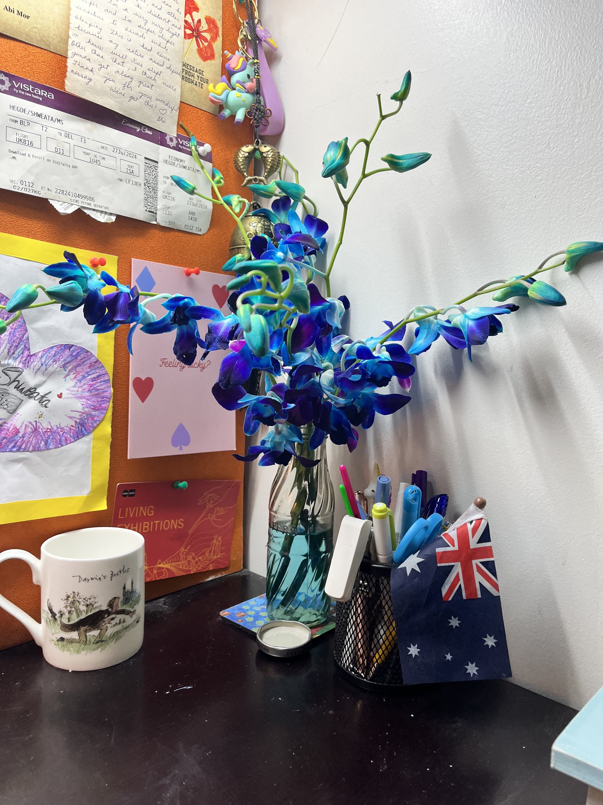
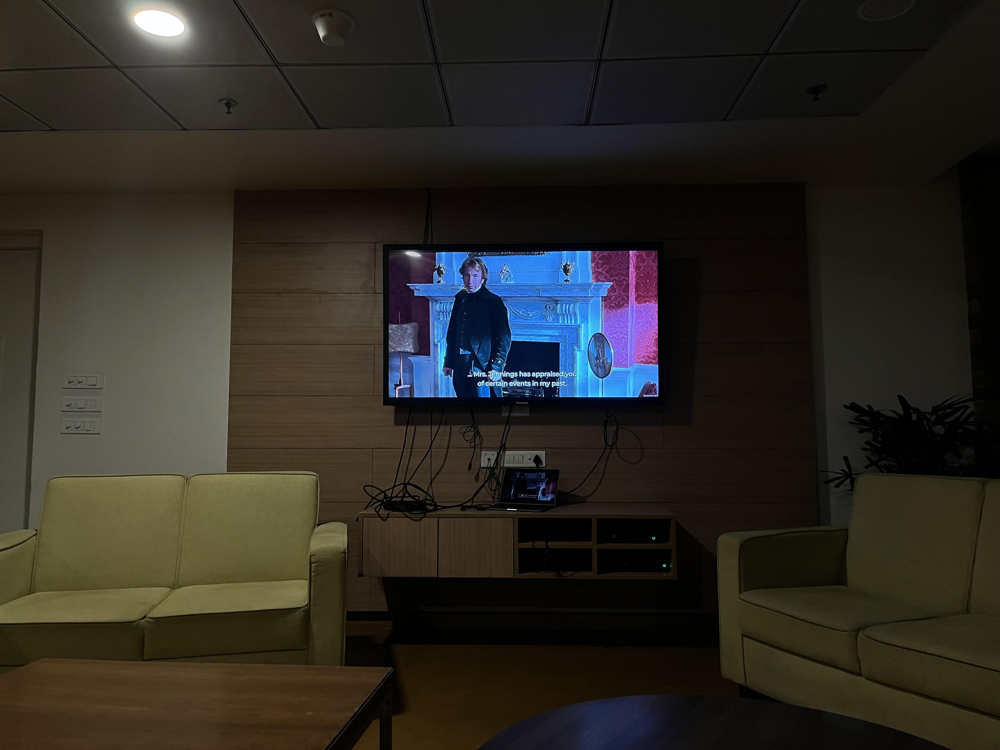
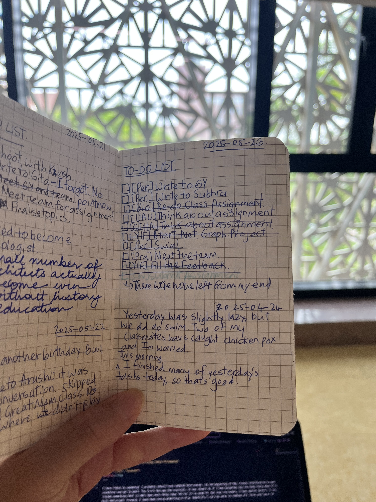

I have taken to swimming! I probably should have updated here sooner. In the beginning of May, Arushi convinced me to get swimdress and go to pool. The first day was the scariest. It was almost as if I had forgotten how the body feels when it's inside something that is 100 times more dense than the air it is used to. But over the weeks, I have gotten better. I can kick and propel forward. I have been doing breathing drills; hopefully I will be able to combine all these and learn to swim soon. Swimming is one of the few things that has given me back the joy of learning.

Term 07 ended. Design thinking was a pain to get through; I don't think I learnt anything meaningful from the process. Language course was probably my favourite. I loved the readings for Sustainable Development; but I somehow did not like the overall course experience. We also had couple of more game nights for Pralay; it's been fun but I also am starting to not like being around screaming and enthusiastic players all the time.

Without a day to rest, Term 08 began. However, we only have two elective courses. It is not loaded as compared to all the other terms. The first elective, Universe and Us, has been super fun. I feel like I am living my high school dream studying astronomy from world experts. Whenever I am in class, I reminisce the awe I felt for science watching VSauce and Veritasium videos. The second elective, Great Ideas, Hard Numbers, is taught by Prof. Gautam Menon. I have known Prof. Menon's work since COVID. To being a Twitter follower and a fan of his work to sit in class---it's again a dream come true.

That said, I wish I felt content with all I had. But everyday, I feel restless. It seems to take forever to get to June 15th, the Chevening result day. I worry that I won't get it and that my dream to do a Masters abroad will forever remain a dream. I look around and see a lot of my friends applying for VISA and preparing for their Masters. I feel left out. I want to be them, but I won't know until 15th.

K. and I celebrated our second year by watching How To Train a Dragon 03. I also got flowers, yay :) I wish I could do something meaninful to mark the ocassion, but as it stands I really don't have the headspace to write or even reflect. The scholarship results, the fellowship, the uncertainity of what next has eclipsed other emotions and priorities.

_K.'s orchids_

To make things worse, Arushi and I had a fight, and I haven't fully bounced back since. Friends mostly make, sometimes break your day. This was one of those instances when my day was made worse because of the misunderstanding. Hopefully, things become better for us. We watched Sense and Sensibilities last week and we might watch another movie this week. 

_Sense and Sensibiliites. Alan Rickman_

Oh, and yes. I have consistently managed to keep a to-do list check, where I also write in a paragraph or two about my day (mostly work).

_To-do list notebook_

I guess that is it from my end for this month.