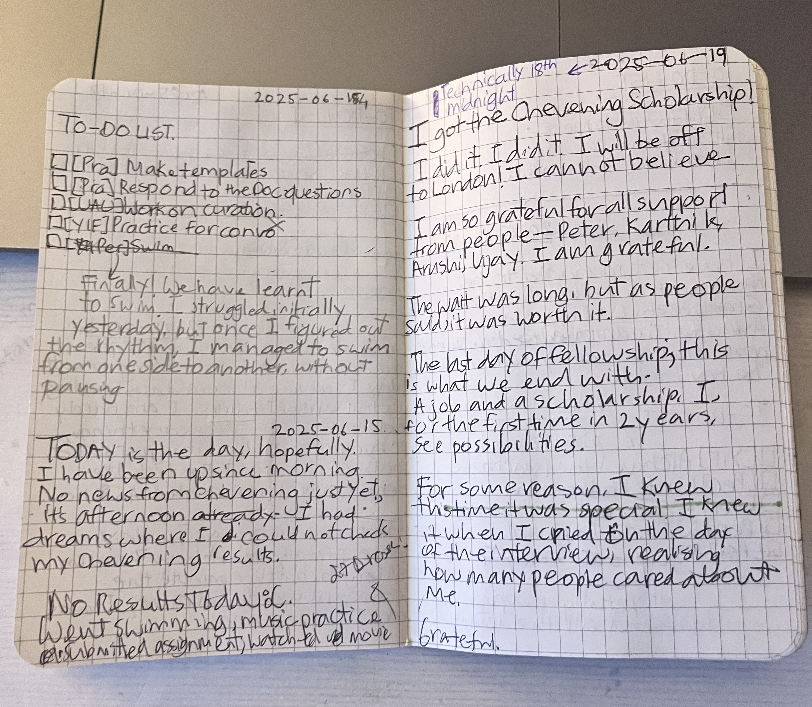

Term 08 started and ended; before I even realised. The term was filled with anticipation, uncertainity, resisting change and gratefulness.

Both the electives---Exploring The Universe and Great Ideas, Hard Numbers---were brilliant courses. Although slightly stressful at times, I enjoyed working on the assignments. Lectures were great fun, too. I asked the most number of questions in this final term.

I learnt how to swim, too. It was a very rewarding process. I can freestyle swim the breadth of the 25m pool. So, yay :) Joy of learning at its peak.

The anticipation of Chevening grew more and more. After June 15th, the day we were supposed to hear back, I became extremely anxious. The results was the only thing running in my mind for the next few days. Finally, on June 18th evening, while I was working on my final presentation for Exploring The Universe, I saw a Chevening email. "Congratulations...", it read. That was it. First thing, I hugged Arushi, then began a lot of yelling and happy noises. 

_Gratitude note written on the day_