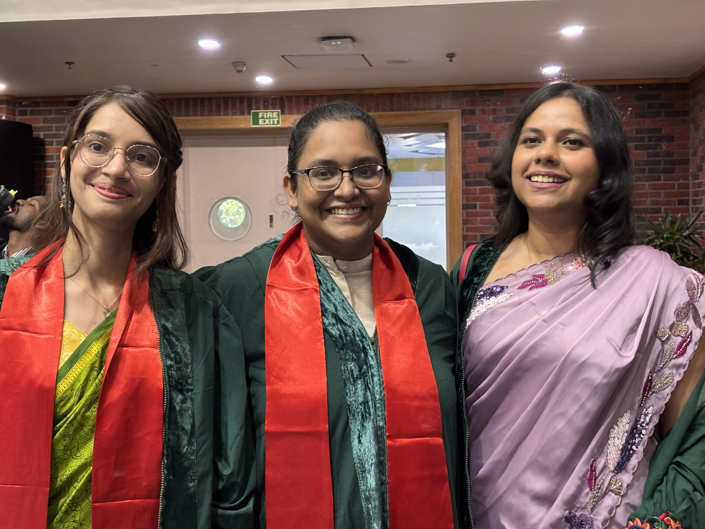
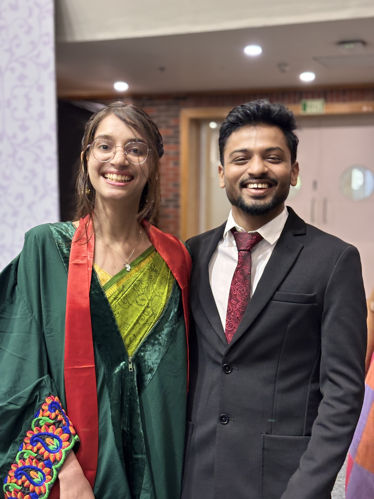
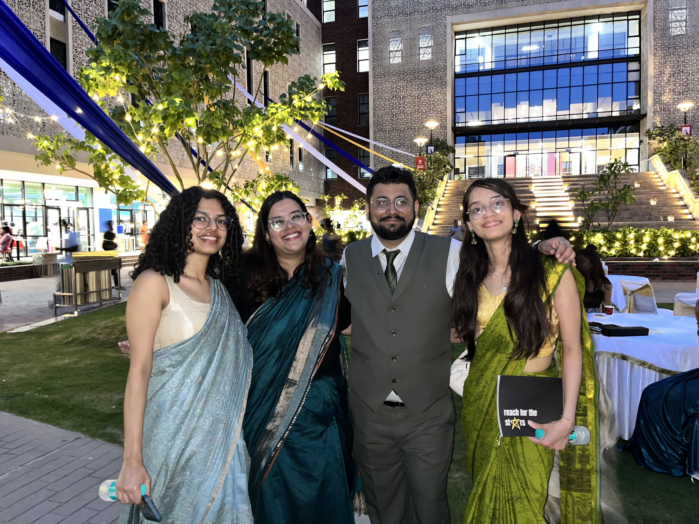
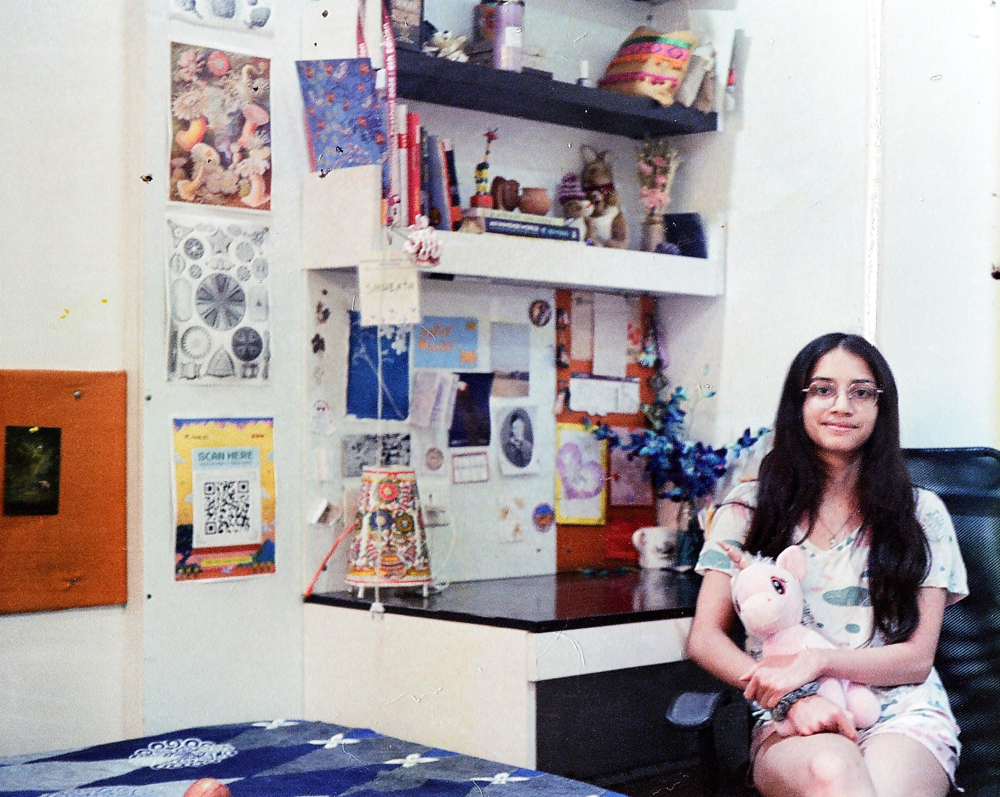
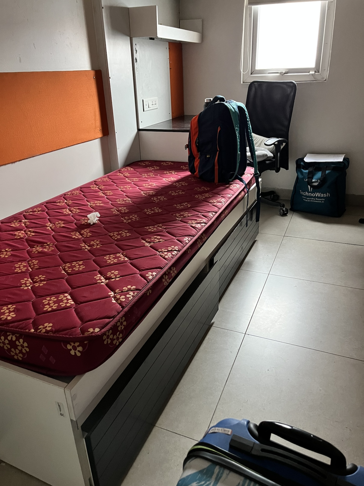

Late update. But three weeks ago, YIF came to an end. The last few days were spent packing, talking to people, music practice, more packing, and some crying. Just like that I was home. The YIF for me was the people; people who supported me, reassured me, helped me, and with whom I shared memories with. I am going to miss them. But I am also glad I am out of the place. Too much of falling sick, not eating enough.

I do feel like a very different person from what I was a year ago. I am more aware: politically, economically, entreprenuerally, culturally, and as a human. I could not be more grateful to all the professors, TAs and my fellow fellows. 

Some pictures---

_Collecting my Diploma_

_Performing, #onelasttime_

_Pralay winning the Outstanding ELM Award (funny how we are looking in different directions. This is the best picture though)_

Some more pictures---

With friends :)

_With Arushi and Sneha_

_With Abi_

_With Praveen_

_With Pravin_

_With Tanvi, Anushka and Abhishek_

Few final pictures---

_Picture credit: Kush_

_Room one last time_